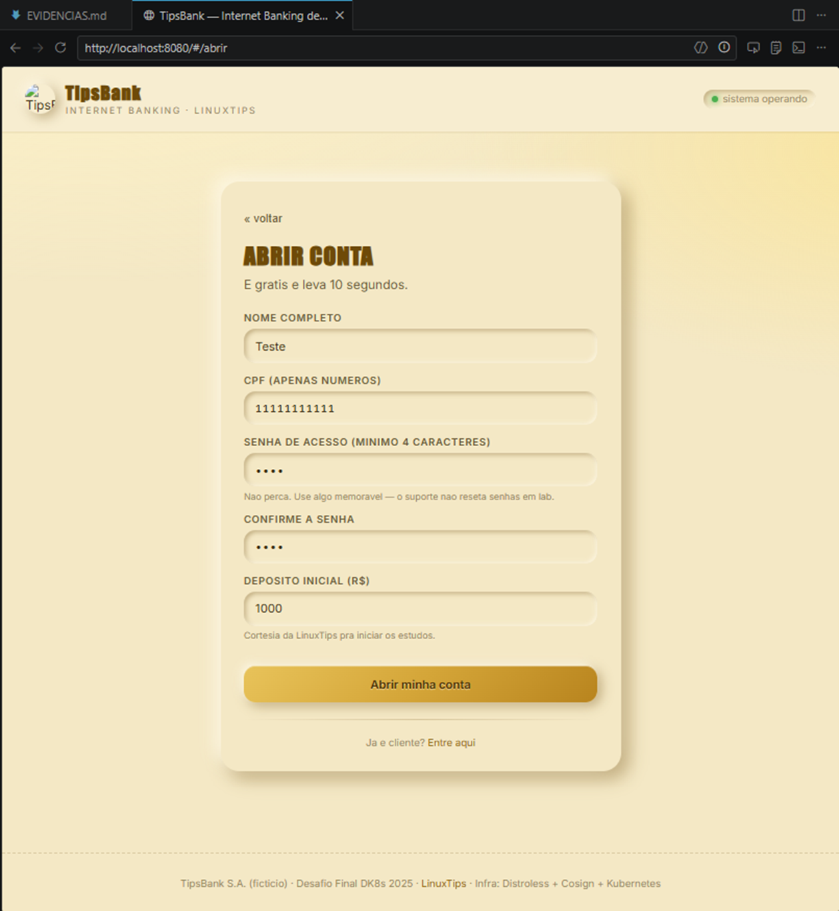
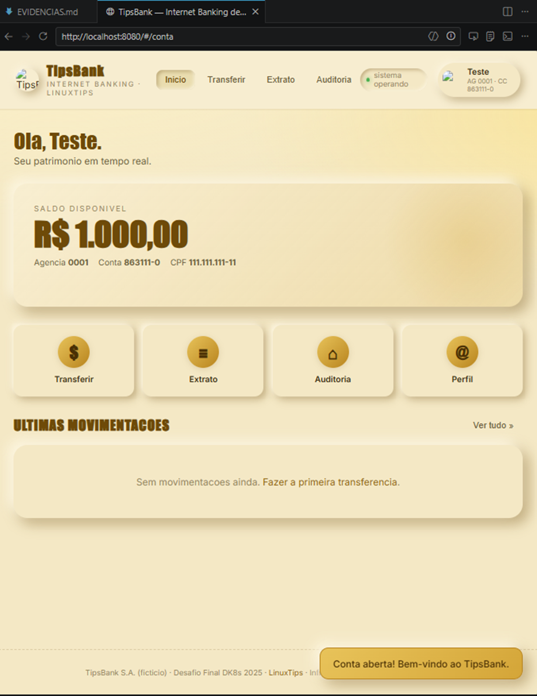
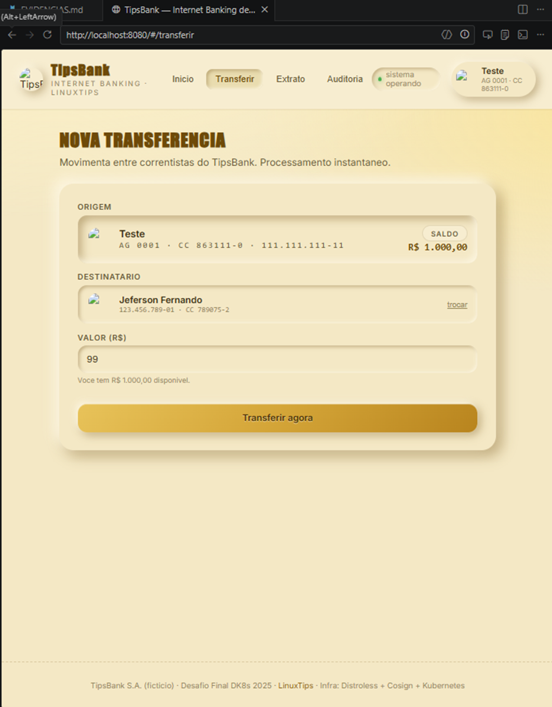
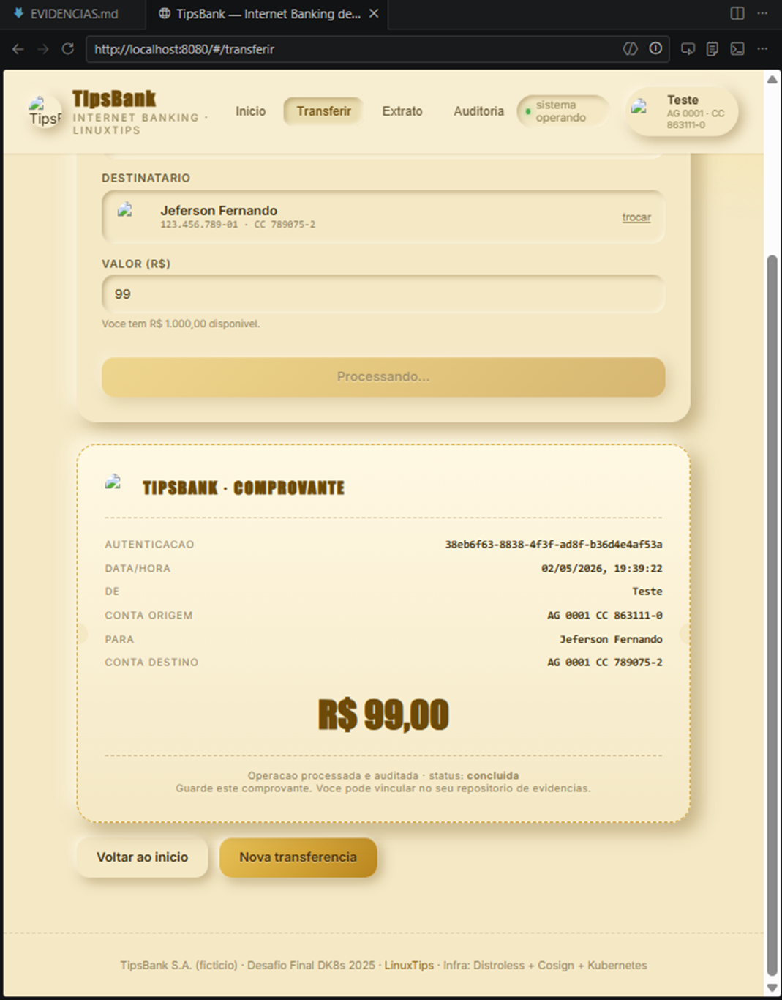
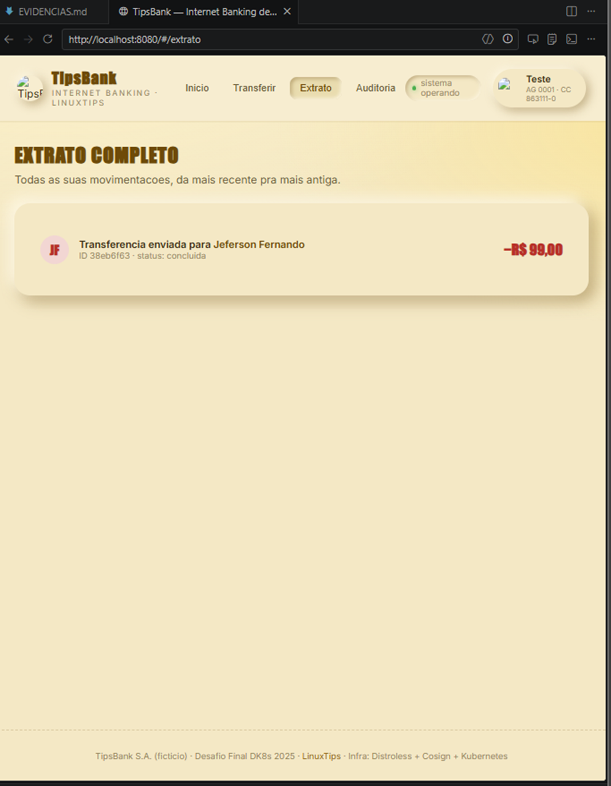

# Evidências - Desafio Final TipsBank Kubernetes

Este documento contém os registros de execução (prints, outputs de comandos e justificativas) solicitados nos critérios de aceite do projeto, conforme as etapas do `MANUAL-ALUNO.md`.

---

## SEMANA 1 — Fundações

### Etapa 1.1 — Entender a aplicação localmente

**1. Listagem das contas seed:**
> `curl http://localhost:8081/contas` retorna as 2 contas seed (sem campo `senha_hash` exposto).
```bash
romul@HOME MINGW64 /h/Cursos/linuxtips/linuxtips-workspace (main)
$ curl http://localhost:8081/contas
[{"id":"11111111-1111-1111-1111-111111111111","titular":"Jeferson Fernando","documento":"12345678901","saldo":"10000.00"},{"id":"22222222-2222-2222-2222-222222222222","titular":"LinuxTips SA","documento":"98765432100","saldo":"500.00"},{"id":"22f991da-4bb2-4557-8209-3c214e5edfaa","titular":"Romulo Alves","documento":"12208847741","saldo":"1000.00"}]
```

**2. Teste de Autenticação (Login):**
> Login bate 200 com senha certa e 401 com errada.
```bash
romul@HOME MINGW64 /h/Cursos/linuxtips/linuxtips-workspace (main)
$ curl -X POST http://localhost:8081/login -H 'content-type: application/json' -d '{"documento":"12345678901","senha":"giropops"}'
{"id":"11111111-1111-1111-1111-111111111111","titular":"Jeferson Fernando","documento":"12345678901","saldo":"10000.00"}
```
```bash
romul@HOME MINGW64 /h/Cursos/linuxtips/linuxtips-workspace (main)
$ curl -X POST http://localhost:8081/login -H 'content-type: application/json' -d '{"documento":"12345678901","senha":"giropops1"}'
{"detail":"credenciais invalidas"}
```

**3. Transferência de fundos:**
> Uma transferência de R$ 100 muda o saldo de ambas as contas.
```bash
# 1. Listar as contas para verificar os saldos antes da transferência
romul@HOME MINGW64 /h/Cursos/linuxtips/linuxtips-workspace (main)
$ curl -s http://localhost:8081/contas | jq
[
  {
    "id": "11111111-1111-1111-1111-111111111111",
    "titular": "Jeferson Fernando",
    "documento": "12345678901",
    "saldo": "10000.00"
  },
  {
    "id": "22222222-2222-2222-2222-222222222222",
    "titular": "LinuxTips SA",
    "documento": "98765432100",
    "saldo": "500.00"
  }
]

# 2. Fazer uma transferência de R$ 100.00 da conta origem para a destino
romul@HOME MINGW64 /h/Cursos/linuxtips/linuxtips-workspace (main)
$ curl -s -X POST http://localhost:8082/transferencias \
  -H 'content-type: application/json' \
  -d '{
    "origem_id":"11111111-1111-1111-1111-111111111111",
    "destino_id":"22222222-2222-2222-2222-222222222222",
    "valor":"100.00"
  }' | jq
{
  "id": "7250d0d1-939f-451b-8c35-78a0e2e4f166",
  "origem_id": "11111111-1111-1111-1111-111111111111",
  "destino_id": "22222222-2222-2222-2222-222222222222",
  "valor": "100.00",
  "status": "concluida"
}

# 3. Listar as contas novamente para comprovar que o saldo mudou em ambas as contas
romul@HOME MINGW64 /h/Cursos/linuxtips/linuxtips-workspace (main)
$ curl -s http://localhost:8081/contas | jq
[
  {
    "id": "11111111-1111-1111-1111-111111111111",
    "titular": "Jeferson Fernando",
    "documento": "12345678901",
    "saldo": "9900.00"
  },
  {
    "id": "22222222-2222-2222-2222-222222222222",
    "titular": "LinuxTips SA",
    "documento": "98765432100",
    "saldo": "600.00"
  }
]
```

**4. Arquivo de eventos na Auditoria:**
> O arquivo `/data/eventos-YYYY-MM-DD.jsonl` dentro do container `auditoria` tem uma linha por transferência.
```bash
romul@HOME MINGW64 /h/Cursos/linuxtips/linuxtips-workspace (main)
$ docker exec -it tipsbank-auditoria python3 -c "print(open('/data/eventos-2026-05-02.jsonl').read())"
{"id": "564d42ad-8bb0-468d-a241-184e22df9eb0", "recebido_em": "2026-05-02T22:30:02.591594+00:00", "tipo": "transferencia", "transacao_id": "7250d0d1-939f-451b-8c35-78a0e2e4f166", "origem_id": "11111111-1111-1111-1111-111111111111", "destino_id": "22222222-2222-2222-2222-222222222222", "valor": "100.00", "versao_app": "v1"}
```

**5. Teste SPA de ponta a ponta:**
> SPA em `localhost:8080` funciona ponta a ponta (abrir, logar, transferir, ver extrato).

**1. Criação de Conta:**


**2. Conta Logada:**


**3. Transferência:**


**4. Comprovante de Transferência:**


**5. Extrato:**


---

### Etapa 1.2 — Build Distroless, scan com Trivy, assinatura Cosign

**1. Verificação de Vulnerabilidades com Trivy:**
> `trivy image` devolve **0 vulnerabilidades HIGH ou CRITICAL** nas 4 imagens.
```bash
romul@HOME MINGW64 /h/Cursos/linuxtips/linuxtips-workspace/projetos/desafio-final-dk8s/semana-1 (main)
$ trivy image --severity HIGH,CRITICAL romulow22/tipsbank-api-contas:v1.0.0
2026-05-02T20:55:46-03:00       INFO    [vuln] Vulnerability scanning is enabled
2026-05-02T20:55:46-03:00       INFO    [secret] Secret scanning is enabled
2026-05-02T20:55:46-03:00       INFO    [secret] If your scanning is slow, please try '--scanners vuln' to disable secret scanning
2026-05-02T20:55:46-03:00       INFO    [secret] Please see https://trivy.dev/docs/v0.69/guide/scanner/secret#recommendation for faster secret detection
2026-05-02T20:55:46-03:00       INFO    Detected OS     family="wolfi" version="20230201"
2026-05-02T20:55:46-03:00       INFO    [wolfi] Detecting vulnerabilities...    pkg_num=25
2026-05-02T20:55:46-03:00       INFO    Number of language-specific files       num=1
2026-05-02T20:55:46-03:00       INFO    [python-pkg] Detecting vulnerabilities...

Report Summary

┌───────────────────────────────────────────────────────┬────────────┬─────────────────┬─────────┐
│                        Target                         │    Type    │ Vulnerabilities │ Secrets │
├───────────────────────────────────────────────────────┼────────────┼─────────────────┼─────────┤
│ romulow22/tipsbank-api-contas:v1.0.0 (wolfi 20230201) │   wolfi    │        0        │    -    │
├───────────────────────────────────────────────────────┼────────────┼─────────────────┼─────────┤
│ packages/SQLAlchemy-2.0.35.dist-info/METADATA         │ python-pkg │        0        │    -    │
├───────────────────────────────────────────────────────┼────────────┼─────────────────┼─────────┤
│ packages/annotated_doc-0.0.4.dist-info/METADATA       │ python-pkg │        0        │    -    │
├───────────────────────────────────────────────────────┼────────────┼─────────────────┼─────────┤
│ packages/annotated_types-0.7.0.dist-info/METADATA     │ python-pkg │        0        │    -    │
├───────────────────────────────────────────────────────┼────────────┼─────────────────┼─────────┤
│ packages/anyio-4.13.0.dist-info/METADATA              │ python-pkg │        0        │    -    │
├───────────────────────────────────────────────────────┼────────────┼─────────────────┼─────────┤
│ packages/bcrypt-4.2.0.dist-info/METADATA              │ python-pkg │        0        │    -    │
├───────────────────────────────────────────────────────┼────────────┼─────────────────┼─────────┤
│ packages/click-8.3.3.dist-info/METADATA               │ python-pkg │        0        │    -    │
├───────────────────────────────────────────────────────┼────────────┼─────────────────┼─────────┤
│ packages/fastapi-0.136.1.dist-info/METADATA           │ python-pkg │        0        │    -    │
├───────────────────────────────────────────────────────┼────────────┼─────────────────┼─────────┤
│ packages/h11-0.16.0.dist-info/METADATA                │ python-pkg │        0        │    -    │
├───────────────────────────────────────────────────────┼────────────┼─────────────────┼─────────┤
│ packages/httptools-0.7.1.dist-info/METADATA           │ python-pkg │        0        │    -    │
├───────────────────────────────────────────────────────┼────────────┼─────────────────┼─────────┤
│ packages/idna-3.13.dist-info/METADATA                 │ python-pkg │        0        │    -    │
├───────────────────────────────────────────────────────┼────────────┼─────────────────┼─────────┤
│ packages/prometheus_client-0.20.0.dist-info/METADATA  │ python-pkg │        0        │    -    │
├───────────────────────────────────────────────────────┼────────────┼─────────────────┼─────────┤
│ packages/psycopg-3.2.13.dist-info/METADATA            │ python-pkg │        0        │    -    │
├───────────────────────────────────────────────────────┼────────────┼─────────────────┼─────────┤
│ packages/psycopg_binary-3.2.13.dist-info/METADATA     │ python-pkg │        0        │    -    │
├───────────────────────────────────────────────────────┼────────────┼─────────────────┼─────────┤
│ packages/pydantic-2.13.3.dist-info/METADATA           │ python-pkg │        0        │    -    │
├───────────────────────────────────────────────────────┼────────────┼─────────────────┼─────────┤
│ packages/pydantic_core-2.46.3.dist-info/METADATA      │ python-pkg │        0        │    -    │
├───────────────────────────────────────────────────────┼────────────┼─────────────────┼─────────┤
│ packages/python_dotenv-1.2.2.dist-info/METADATA       │ python-pkg │        0        │    -    │
├───────────────────────────────────────────────────────┼────────────┼─────────────────┼─────────┤
│ packages/pyyaml-6.0.3.dist-info/METADATA              │ python-pkg │        0        │    -    │
├───────────────────────────────────────────────────────┼────────────┼─────────────────┼─────────┤
│ packages/starlette-1.0.0.dist-info/METADATA           │ python-pkg │        0        │    -    │
├───────────────────────────────────────────────────────┼────────────┼─────────────────┼─────────┤
│ packages/typing_extensions-4.15.0.dist-info/METADATA  │ python-pkg │        0        │    -    │
├───────────────────────────────────────────────────────┼────────────┼─────────────────┼─────────┤
│ packages/typing_inspection-0.4.2.dist-info/METADATA   │ python-pkg │        0        │    -    │
├───────────────────────────────────────────────────────┼────────────┼─────────────────┼─────────┤
│ packages/uvicorn-0.30.6.dist-info/METADATA            │ python-pkg │        0        │    -    │
├───────────────────────────────────────────────────────┼────────────┼─────────────────┼─────────┤
│ packages/uvloop-0.22.1.dist-info/METADATA             │ python-pkg │        0        │    -    │
├───────────────────────────────────────────────────────┼────────────┼─────────────────┼─────────┤
│ packages/watchfiles-1.1.1.dist-info/METADATA          │ python-pkg │        0        │    -    │
├───────────────────────────────────────────────────────┼────────────┼─────────────────┼─────────┤
│ packages/websockets-16.0.dist-info/METADATA           │ python-pkg │        0        │    -    │
└───────────────────────────────────────────────────────┴────────────┴─────────────────┴─────────┘
Legend:
- '-': Not scanned
- '0': Clean (no security findings detected)


```
```bash
romul@HOME MINGW64 /h/Cursos/linuxtips/linuxtips-workspace/projetos/desafio-final-dk8s/semana-1 (main)
$ trivy image --severity HIGH,CRITICAL romulow22/tipsbank-api-transacoes:v1.0.0
2026-05-02T20:55:31-03:00       INFO    [vuln] Vulnerability scanning is enabled
2026-05-02T20:55:31-03:00       INFO    [secret] Secret scanning is enabled
2026-05-02T20:55:31-03:00       INFO    [secret] If your scanning is slow, please try '--scanners vuln' to disable secret scanning
2026-05-02T20:55:31-03:00       INFO    [secret] Please see https://trivy.dev/docs/v0.69/guide/scanner/secret#recommendation for faster secret detection
2026-05-02T20:55:31-03:00       INFO    Detected OS     family="wolfi" version="20230201"
2026-05-02T20:55:31-03:00       INFO    [wolfi] Detecting vulnerabilities...    pkg_num=25
2026-05-02T20:55:31-03:00       INFO    Number of language-specific files       num=1
2026-05-02T20:55:31-03:00       INFO    [python-pkg] Detecting vulnerabilities...

Report Summary

┌───────────────────────────────────────────────────────────┬────────────┬─────────────────┬─────────┐
│                          Target                           │    Type    │ Vulnerabilities │ Secrets │
├───────────────────────────────────────────────────────────┼────────────┼─────────────────┼─────────┤
│ romulow22/tipsbank-api-transacoes:v1.0.0 (wolfi 20230201) │   wolfi    │        0        │    -    │
├───────────────────────────────────────────────────────────┼────────────┼─────────────────┼─────────┤
│ packages/SQLAlchemy-2.0.35.dist-info/METADATA             │ python-pkg │        0        │    -    │
├───────────────────────────────────────────────────────────┼────────────┼─────────────────┼─────────┤
│ packages/annotated_doc-0.0.4.dist-info/METADATA           │ python-pkg │        0        │    -    │
├───────────────────────────────────────────────────────────┼────────────┼─────────────────┼─────────┤
│ packages/annotated_types-0.7.0.dist-info/METADATA         │ python-pkg │        0        │    -    │
├───────────────────────────────────────────────────────────┼────────────┼─────────────────┼─────────┤
│ packages/anyio-4.13.0.dist-info/METADATA                  │ python-pkg │        0        │    -    │
├───────────────────────────────────────────────────────────┼────────────┼─────────────────┼─────────┤
│ packages/certifi-2026.4.22.dist-info/METADATA             │ python-pkg │        0        │    -    │
├───────────────────────────────────────────────────────────┼────────────┼─────────────────┼─────────┤
│ packages/click-8.3.3.dist-info/METADATA                   │ python-pkg │        0        │    -    │
├───────────────────────────────────────────────────────────┼────────────┼─────────────────┼─────────┤
│ packages/fastapi-0.136.1.dist-info/METADATA               │ python-pkg │        0        │    -    │
├───────────────────────────────────────────────────────────┼────────────┼─────────────────┼─────────┤
│ packages/h11-0.16.0.dist-info/METADATA                    │ python-pkg │        0        │    -    │
├───────────────────────────────────────────────────────────┼────────────┼─────────────────┼─────────┤
│ packages/httpcore-1.0.9.dist-info/METADATA                │ python-pkg │        0        │    -    │
├───────────────────────────────────────────────────────────┼────────────┼─────────────────┼─────────┤
│ packages/httptools-0.7.1.dist-info/METADATA               │ python-pkg │        0        │    -    │
├───────────────────────────────────────────────────────────┼────────────┼─────────────────┼─────────┤
│ packages/httpx-0.27.2.dist-info/METADATA                  │ python-pkg │        0        │    -    │
├───────────────────────────────────────────────────────────┼────────────┼─────────────────┼─────────┤
│ packages/idna-3.13.dist-info/METADATA                     │ python-pkg │        0        │    -    │
├───────────────────────────────────────────────────────────┼────────────┼─────────────────┼─────────┤
│ packages/prometheus_client-0.20.0.dist-info/METADATA      │ python-pkg │        0        │    -    │
├───────────────────────────────────────────────────────────┼────────────┼─────────────────┼─────────┤
│ packages/psycopg-3.2.13.dist-info/METADATA                │ python-pkg │        0        │    -    │
├───────────────────────────────────────────────────────────┼────────────┼─────────────────┼─────────┤
│ packages/psycopg_binary-3.2.13.dist-info/METADATA         │ python-pkg │        0        │    -    │
├───────────────────────────────────────────────────────────┼────────────┼─────────────────┼─────────┤
│ packages/pydantic-2.13.3.dist-info/METADATA               │ python-pkg │        0        │    -    │
├───────────────────────────────────────────────────────────┼────────────┼─────────────────┼─────────┤
│ packages/pydantic_core-2.46.3.dist-info/METADATA          │ python-pkg │        0        │    -    │
├───────────────────────────────────────────────────────────┼────────────┼─────────────────┼─────────┤
│ packages/python_dotenv-1.2.2.dist-info/METADATA           │ python-pkg │        0        │    -    │
├───────────────────────────────────────────────────────────┼────────────┼─────────────────┼─────────┤
│ packages/pyyaml-6.0.3.dist-info/METADATA                  │ python-pkg │        0        │    -    │
├───────────────────────────────────────────────────────────┼────────────┼─────────────────┼─────────┤
│ packages/sniffio-1.3.1.dist-info/METADATA                 │ python-pkg │        0        │    -    │
├───────────────────────────────────────────────────────────┼────────────┼─────────────────┼─────────┤
│ packages/starlette-1.0.0.dist-info/METADATA               │ python-pkg │        0        │    -    │
├───────────────────────────────────────────────────────────┼────────────┼─────────────────┼─────────┤
│ packages/typing_extensions-4.15.0.dist-info/METADATA      │ python-pkg │        0        │    -    │
├───────────────────────────────────────────────────────────┼────────────┼─────────────────┼─────────┤
│ packages/typing_inspection-0.4.2.dist-info/METADATA       │ python-pkg │        0        │    -    │
├───────────────────────────────────────────────────────────┼────────────┼─────────────────┼─────────┤
│ packages/uvicorn-0.30.6.dist-info/METADATA                │ python-pkg │        0        │    -    │
├───────────────────────────────────────────────────────────┼────────────┼─────────────────┼─────────┤
│ packages/uvloop-0.22.1.dist-info/METADATA                 │ python-pkg │        0        │    -    │
├───────────────────────────────────────────────────────────┼────────────┼─────────────────┼─────────┤
│ packages/watchfiles-1.1.1.dist-info/METADATA              │ python-pkg │        0        │    -    │
├───────────────────────────────────────────────────────────┼────────────┼─────────────────┼─────────┤
│ packages/websockets-16.0.dist-info/METADATA               │ python-pkg │        0        │    -    │
└───────────────────────────────────────────────────────────┴────────────┴─────────────────┴─────────┘
Legend:
- '-': Not scanned
- '0': Clean (no security findings detected)


```
```bash
romul@HOME MINGW64 /h/Cursos/linuxtips/linuxtips-workspace/projetos/desafio-final-dk8s/semana-1 (main)
$ trivy image --severity HIGH,CRITICAL romulow22/tipsbank-auditoria:v1.0.0
2026-05-02T20:55:11-03:00       INFO    [vuln] Vulnerability scanning is enabled
2026-05-02T20:55:11-03:00       INFO    [secret] Secret scanning is enabled
2026-05-02T20:55:11-03:00       INFO    [secret] If your scanning is slow, please try '--scanners vuln' to disable secret scanning
2026-05-02T20:55:11-03:00       INFO    [secret] Please see https://trivy.dev/docs/v0.69/guide/scanner/secret#recommendation for faster secret detection
2026-05-02T20:55:11-03:00       INFO    Detected OS     family="wolfi" version="20230201"
2026-05-02T20:55:11-03:00       INFO    [wolfi] Detecting vulnerabilities...    pkg_num=25
2026-05-02T20:55:11-03:00       INFO    Number of language-specific files       num=1
2026-05-02T20:55:11-03:00       INFO    [python-pkg] Detecting vulnerabilities...

Report Summary

┌──────────────────────────────────────────────────────┬────────────┬─────────────────┬─────────┐
│                        Target                        │    Type    │ Vulnerabilities │ Secrets │
├──────────────────────────────────────────────────────┼────────────┼─────────────────┼─────────┤
│ romulow22/tipsbank-auditoria:v1.0.0 (wolfi 20230201) │   wolfi    │        0        │    -    │
├──────────────────────────────────────────────────────┼────────────┼─────────────────┼─────────┤
│ packages/annotated_doc-0.0.4.dist-info/METADATA      │ python-pkg │        0        │    -    │
├──────────────────────────────────────────────────────┼────────────┼─────────────────┼─────────┤
│ packages/annotated_types-0.7.0.dist-info/METADATA    │ python-pkg │        0        │    -    │
├──────────────────────────────────────────────────────┼────────────┼─────────────────┼─────────┤
│ packages/anyio-4.13.0.dist-info/METADATA             │ python-pkg │        0        │    -    │
├──────────────────────────────────────────────────────┼────────────┼─────────────────┼─────────┤
│ packages/click-8.3.3.dist-info/METADATA              │ python-pkg │        0        │    -    │
├──────────────────────────────────────────────────────┼────────────┼─────────────────┼─────────┤
│ packages/fastapi-0.136.1.dist-info/METADATA          │ python-pkg │        0        │    -    │
├──────────────────────────────────────────────────────┼────────────┼─────────────────┼─────────┤
│ packages/h11-0.16.0.dist-info/METADATA               │ python-pkg │        0        │    -    │
├──────────────────────────────────────────────────────┼────────────┼─────────────────┼─────────┤
│ packages/httptools-0.7.1.dist-info/METADATA          │ python-pkg │        0        │    -    │
├──────────────────────────────────────────────────────┼────────────┼─────────────────┼─────────┤
│ packages/idna-3.13.dist-info/METADATA                │ python-pkg │        0        │    -    │
├──────────────────────────────────────────────────────┼────────────┼─────────────────┼─────────┤
│ packages/prometheus_client-0.20.0.dist-info/METADATA │ python-pkg │        0        │    -    │
├──────────────────────────────────────────────────────┼────────────┼─────────────────┼─────────┤
│ packages/pydantic-2.13.3.dist-info/METADATA          │ python-pkg │        0        │    -    │
├──────────────────────────────────────────────────────┼────────────┼─────────────────┼─────────┤
│ packages/pydantic_core-2.46.3.dist-info/METADATA     │ python-pkg │        0        │    -    │
├──────────────────────────────────────────────────────┼────────────┼─────────────────┼─────────┤
│ packages/python_dotenv-1.2.2.dist-info/METADATA      │ python-pkg │        0        │    -    │
├──────────────────────────────────────────────────────┼────────────┼─────────────────┼─────────┤
│ packages/pyyaml-6.0.3.dist-info/METADATA             │ python-pkg │        0        │    -    │
├──────────────────────────────────────────────────────┼────────────┼─────────────────┼─────────┤
│ packages/starlette-1.0.0.dist-info/METADATA          │ python-pkg │        0        │    -    │
├──────────────────────────────────────────────────────┼────────────┼─────────────────┼─────────┤
│ packages/typing_extensions-4.15.0.dist-info/METADATA │ python-pkg │        0        │    -    │
├──────────────────────────────────────────────────────┼────────────┼─────────────────┼─────────┤
│ packages/typing_inspection-0.4.2.dist-info/METADATA  │ python-pkg │        0        │    -    │
├──────────────────────────────────────────────────────┼────────────┼─────────────────┼─────────┤
│ packages/uvicorn-0.30.6.dist-info/METADATA           │ python-pkg │        0        │    -    │
├──────────────────────────────────────────────────────┼────────────┼─────────────────┼─────────┤
│ packages/uvloop-0.22.1.dist-info/METADATA            │ python-pkg │        0        │    -    │
├──────────────────────────────────────────────────────┼────────────┼─────────────────┼─────────┤
│ packages/watchfiles-1.1.1.dist-info/METADATA         │ python-pkg │        0        │    -    │
├──────────────────────────────────────────────────────┼────────────┼─────────────────┼─────────┤
│ packages/websockets-16.0.dist-info/METADATA          │ python-pkg │        0        │    -    │
└──────────────────────────────────────────────────────┴────────────┴─────────────────┴─────────┘
Legend:
- '-': Not scanned
- '0': Clean (no security findings detected)


```
```bash
romul@HOME MINGW64 /h/Cursos/linuxtips/linuxtips-workspace/projetos/desafio-final-dk8s/semana-1 (main)
$ trivy image --severity HIGH,CRITICAL romulow22/tipsbank-web:v1.0.0
2026-05-02T20:54:42-03:00       INFO    [vuln] Vulnerability scanning is enabled
2026-05-02T20:54:42-03:00       INFO    [secret] Secret scanning is enabled
2026-05-02T20:54:42-03:00       INFO    [secret] If your scanning is slow, please try '--scanners vuln' to disable secret scanning
2026-05-02T20:54:42-03:00       INFO    [secret] Please see https://trivy.dev/docs/v0.69/guide/scanner/secret#recommendation for faster secret detection
2026-05-02T20:54:43-03:00       INFO    Detected OS     family="wolfi" version="20230201"
2026-05-02T20:54:43-03:00       INFO    [wolfi] Detecting vulnerabilities...    pkg_num=19
2026-05-02T20:54:43-03:00       INFO    Number of language-specific files       num=0

Report Summary

┌────────────────────────────────────────────────┬───────┬─────────────────┬─────────┐
│                     Target                     │ Type  │ Vulnerabilities │ Secrets │
├────────────────────────────────────────────────┼───────┼─────────────────┼─────────┤
│ romulow22/tipsbank-web:v1.0.0 (wolfi 20230201) │ wolfi │        0        │    -    │
└────────────────────────────────────────────────┴───────┴─────────────────┴─────────┘
Legend:
- '-': Not scanned
- '0': Clean (no security findings detected)
```

**3. Relatório do Docker Scout:**
> Rode o Docker Scout e anexe o relatório.
```bash
romul@HOME MINGW64 /h/Cursos/linuxtips/linuxtips-workspace/projetos/desafio-final-dk8s/semana-1 (main)
$ docker scout cves romulow22/tipsbank-api-contas:v1.0.0
    v Image stored for indexing  
    v Indexed 79 packages
    x Detected 1 vulnerable package with 1 vulnerability


## Overview

                   │             Analyzed Image             
───────────────────┼────────────────────────────────────────
 Target            │  romulow22/tipsbank-api-contas:v1.0.0  
   digest          │  c32f93e48a36                          
   platform        │ linux/amd64                            
   vulnerabilities │    0C     0H     1M     0L             
   size            │ 48 MB                                  
   packages        │ 79                                     


## Packages and Vulnerabilities

   0C     0H     1M     0L  pip 26.0.1
pkg:pypi/pip@26.0.1

    x MEDIUM CVE-2026-3219 [Unrestricted Upload of File with Dangerous Type]
      https://scout.docker.com/v/CVE-2026-3219
      Affected range : <=26.0.1                                                        
      Fixed version  : not fixed                                                       
      CVSS Score     : 4.6                                                             
      CVSS Vector    : CVSS:4.0/AV:L/AC:L/AT:N/PR:N/UI:A/VC:N/VI:L/VA:N/SC:N/SI:N/SA:N 
    


1 vulnerability found in 1 package
  CRITICAL  0 
  HIGH      0 
  MEDIUM    1 
  LOW       0 


What's next:
    View base image update recommendations → docker scout recommendations romulow22/tipsbank-api-contas:v1.0.0

```

```bash
romul@HOME MINGW64 /h/Cursos/linuxtips/linuxtips-workspace/projetos/desafio-final-dk8s/semana-1 (main)
$ docker scout cves romulow22/tipsbank-api-transacoes:v1.0.0
    v SBOM of image already cached, 82 packages indexed
    x Detected 1 vulnerable package with 1 vulnerability


## Overview

                   │               Analyzed Image               
───────────────────┼────────────────────────────────────────────
 Target            │  romulow22/tipsbank-api-transacoes:v1.0.0  
   digest          │  d18d5492db2a                              
   platform        │ linux/amd64                                
   vulnerabilities │    0C     0H     1M     0L                 
   size            │ 48 MB                                      
   packages        │ 82                                         


## Packages and Vulnerabilities

   0C     0H     1M     0L  pip 26.0.1
pkg:pypi/pip@26.0.1

    x MEDIUM CVE-2026-3219 [Unrestricted Upload of File with Dangerous Type]
      https://scout.docker.com/v/CVE-2026-3219
      Affected range : <=26.0.1                                                        
      Fixed version  : not fixed                                                       
      CVSS Score     : 4.6                                                             
      CVSS Vector    : CVSS:4.0/AV:L/AC:L/AT:N/PR:N/UI:A/VC:N/VI:L/VA:N/SC:N/SI:N/SA:N 
    


1 vulnerability found in 1 package
  CRITICAL  0 
  HIGH      0 
  MEDIUM    1 
  LOW       0 


What's next:
    View base image update recommendations → docker scout recommendations romulow22/tipsbank-api-transacoes:v1.0.0

```

```bash
romul@HOME MINGW64 /h/Cursos/linuxtips/linuxtips-workspace/projetos/desafio-final-dk8s/semana-1 (main)
$ docker scout cves romulow22/tipsbank-auditoria:v1.0.0
    v SBOM of image already cached, 75 packages indexed
    x Detected 1 vulnerable package with 1 vulnerability


## Overview

                   │            Analyzed Image             
───────────────────┼───────────────────────────────────────
 Target            │  romulow22/tipsbank-auditoria:v1.0.0  
   digest          │  390e2b1c1b1e                         
   platform        │ linux/amd64                           
   vulnerabilities │    0C     0H     1M     0L            
   size            │ 37 MB                                 
   packages        │ 75                                    


## Packages and Vulnerabilities

   0C     0H     1M     0L  pip 26.0.1
pkg:pypi/pip@26.0.1

    x MEDIUM CVE-2026-3219 [Unrestricted Upload of File with Dangerous Type]
      https://scout.docker.com/v/CVE-2026-3219
      Affected range : <=26.0.1                                                        
      Fixed version  : not fixed                                                       
      CVSS Score     : 4.6                                                             
      CVSS Vector    : CVSS:4.0/AV:L/AC:L/AT:N/PR:N/UI:A/VC:N/VI:L/VA:N/SC:N/SI:N/SA:N 
    


1 vulnerability found in 1 package
  CRITICAL  0 
  HIGH      0 
  MEDIUM    1 
  LOW       0 


What's next:
    View base image update recommendations → docker scout recommendations romulow22/tipsbank-auditoria:v1.0.0

```

```bash
romul@HOME MINGW64 /h/Cursos/linuxtips/linuxtips-workspace/projetos/desafio-final-dk8s/semana-1 (main)
$ docker scout cves romulow22/tipsbank-web:v1.0.0
    v Image stored for indexing  
    v Indexed 32 packages
    v No vulnerable package detected


## Overview

                   │         Analyzed Image          
───────────────────┼─────────────────────────────────
 Target            │  romulow22/tipsbank-web:v1.0.0  
   digest          │  63a2065b612d                   
   platform        │ linux/amd64                     
   vulnerabilities │    0C     0H     0M     0L      
   size            │ 7.4 MB                          
   packages        │ 32                              


## Packages and Vulnerabilities

  No vulnerable packages detected

```


**4. Assinatura de Imagens com Cosign:**

> gerar chave
```bash
romul@HOME MINGW64 /h/Cursos/linuxtips/linuxtips-workspace/projetos/desafio-final-dk8s/semana-1 (main)
$ export COSIGN_EXPERIMENTAL=1

romul@HOME MINGW64 /h/Cursos/linuxtips/linuxtips-workspace/projetos/desafio-final-dk8s/semana-1 (main)
$ cosign generate-key-pair
Enter password for private key: 
Enter password for private key again: 
Private key written to cosign.key
Public key written to cosign.pub
```

> assinar imagens
```bash
romul@HOME MINGW64 /h/Cursos/linuxtips/linuxtips-workspace/projetos/desafio-final-dk8s/semana-1 (main)
$ cosign sign --key cosign.key romulow22/tipsbank-api-contas:v1.0.0
WARNING: Image reference romulow22/tipsbank-api-contas:v1.0.0 uses a tag, not a digest, to identify the image to sign.
    This can lead you to sign a different image than the intended one. Please use a
    digest (example.com/ubuntu@sha256:abc123...) rather than tag
    (example.com/ubuntu:latest) for the input to cosign. The ability to refer to
    images by tag will be removed in a future release.

Enter password for private key: 
                      
romul@HOME MINGW64 /h/Cursos/linuxtips/linuxtips-workspace/projetos/desafio-final-dk8s/semana-1 (main)
$ cosign sign --key cosign.key romulow22/tipsbank-api-transacoes:v1.0.0
WARNING: Image reference romulow22/tipsbank-api-transacoes:v1.0.0 uses a tag, not a digest, to identify the image to sign.
    This can lead you to sign a different image than the intended one. Please use a
    digest (example.com/ubuntu@sha256:abc123...) rather than tag
    (example.com/ubuntu:latest) for the input to cosign. The ability to refer to
    images by tag will be removed in a future release.

Enter password for private key: 

romul@HOME MINGW64 /h/Cursos/linuxtips/linuxtips-workspace/projetos/desafio-final-dk8s/semana-1 (main)
$ cosign sign --key cosign.key romulow22/tipsbank-auditoria:v1.0.0
WARNING: Image reference romulow22/tipsbank-auditoria:v1.0.0 uses a tag, not a digest, to identify the image to sign.
    This can lead you to sign a different image than the intended one. Please use a
    digest (example.com/ubuntu@sha256:abc123...) rather than tag
    (example.com/ubuntu:latest) for the input to cosign. The ability to refer to
    images by tag will be removed in a future release.

Enter password for private key: 
                      
romul@HOME MINGW64 /h/Cursos/linuxtips/linuxtips-workspace/projetos/desafio-final-dk8s/semana-1 (main)
$ cosign sign --key cosign.key romulow22/tipsbank-web:v1.0.0
WARNING: Image reference romulow22/tipsbank-web:v1.0.0 uses a tag, not a digest, to identify the image to sign.
    This can lead you to sign a different image than the intended one. Please use a
    digest (example.com/ubuntu@sha256:abc123...) rather than tag
    (example.com/ubuntu:latest) for the input to cosign. The ability to refer to
    images by tag will be removed in a future release.

```


> `cosign verify` passa nas 4 imagens.
```bash
romul@HOME MINGW64 /h/Cursos/linuxtips/linuxtips-workspace/projetos/desafio-final-dk8s/semana-1 (main)
$ cosign verify --key cosign.pub romulow22/tipsbank-api-contas:v1.0.0

Verification for index.docker.io/romulow22/tipsbank-api-contas:v1.0.0 --
The following checks were performed on each of these signatures:
  - The cosign claims were validated
  - Existence of the claims in the transparency log was verified offline
  - The signatures were verified against the specified public key

[{"critical":{"identity":{"docker-reference":"index.docker.io/romulow22/tipsbank-api-contas:v1.0.0"},"image":{"docker-manifest-digest":"sha256:c32f93e48a36e1175c6a2122f531aeff0abf9c84b5ef1ac40a92af04ac036306"},"type":"https://sigstore.dev/cosign/sign/v1"},"optional":{}}]

romul@HOME MINGW64 /h/Cursos/linuxtips/linuxtips-workspace/projetos/desafio-final-dk8s/semana-1 (main)
$ cosign verify --key cosign.pub romulow22/tipsbank-api-transacoes:v1.0.0

Verification for index.docker.io/romulow22/tipsbank-api-transacoes:v1.0.0 --
The following checks were performed on each of these signatures:
  - The cosign claims were validated
  - Existence of the claims in the transparency log was verified offline
  - The signatures were verified against the specified public key

[{"critical":{"identity":{"docker-reference":"index.docker.io/romulow22/tipsbank-api-transacoes:v1.0.0"},"image":{"docker-manifest-digest":"sha256:d18d5492db2a7c102bb29ddeafa0d8ea1a4d43a803ee5ac1b301934324520bf0"},"type":"https://sigstore.dev/cosign/sign/v1"},"optional":{}}]

romul@HOME MINGW64 /h/Cursos/linuxtips/linuxtips-workspace/projetos/desafio-final-dk8s/semana-1 (main)
$ cosign verify --key cosign.pub romulow22/tipsbank-auditoria:v1.0.0

Verification for index.docker.io/romulow22/tipsbank-auditoria:v1.0.0 --
The following checks were performed on each of these signatures:
  - The cosign claims were validated
  - Existence of the claims in the transparency log was verified offline
  - The signatures were verified against the specified public key

[{"critical":{"identity":{"docker-reference":"index.docker.io/romulow22/tipsbank-auditoria:v1.0.0"},"image":{"docker-manifest-digest":"sha256:390e2b1c1b1ec977ab3623424585a4558ce4deab28d4019f54a19efdc73b6271"},"type":"https://sigstore.dev/cosign/sign/v1"},"optional":{}}]

romul@HOME MINGW64 /h/Cursos/linuxtips/linuxtips-workspace/projetos/desafio-final-dk8s/semana-1 (main)
$ cosign verify --key cosign.pub romulow22/tipsbank-web:v1.0.0

Verification for index.docker.io/romulow22/tipsbank-web:v1.0.0 --
The following checks were performed on each of these signatures:
  - The cosign claims were validated
  - Existence of the claims in the transparency log was verified offline
  - The signatures were verified against the specified public key

[{"critical":{"identity":{"docker-reference":"index.docker.io/romulow22/tipsbank-web:v1.0.0"},"image":{"docker-manifest-digest":"sha256:63a2065b612d75bb3bb5222325a62444e35effc3cb63cea0eb8727d7339b2fbb"},"type":"https://sigstore.dev/cosign/sign/v1"},"optional":{}}]

romul@HOME MINGW64 /h/Cursos/linuxtips/linuxtips-workspace/projetos/desafio-final-dk8s/semana-1 (main)
```

**5. Validação de Usuário Não-Root:**
> `docker inspect` mostra que o usuário final é não-root (UID 65532 nas 3 APIs, UID 101 no `web`).
```bash
romul@HOME MINGW64 /h/Cursos/linuxtips/linuxtips-workspace/projetos/desafio-final-dk8s/semana-1 (main)
$ docker inspect romulow22/tipsbank-api-contas:v1.0.0 | grep '"User":'
            "User": "65532",

romul@HOME MINGW64 /h/Cursos/linuxtips/linuxtips-workspace/projetos/desafio-final-dk8s/semana-1 (main)
$ docker inspect romulow22/tipsbank-api-transacoes:v1.0.0 | grep '"User":'
            "User": "65532",
romul@HOME MINGW64 /h/Cursos/linuxtips/linuxtips-workspace/projetos/desafio-final-dk8s/semana-1 (main)
$ docker inspect romulow22/tipsbank-auditoria:v1.0.0 | grep '"User":'
            "User": "65532",

romul@HOME MINGW64 /h/Cursos/linuxtips/linuxtips-workspace/projetos/desafio-final-dk8s/semana-1 (main)
$ docker inspect romulow22/tipsbank-web:v1.0.0 | grep '"User":'
            "User": "65532",

```

**6. Tamanho Final das Imagens:**
> Tamanho final das imagens Python < 150 MB; `web` (nginx) < 30 MB.
```bash
romul@HOME MINGW64 /h/Cursos/linuxtips/linuxtips-workspace/projetos/desafio-final-dk8s/semana-1 (main)
$ docker images | grep "tipsbank"
WARNING: This output is designed for human readability. For machine-readable output, please use --format.
romulow22/tipsbank-api-contas:v1.0.0                                                                                         c32f93e48a36        195MB         47.8MB        
romulow22/tipsbank-api-transacoes:v1.0.0                                                                                     d18d5492db2a        196MB         48.1MB        
romulow22/tipsbank-auditoria:v1.0.0                                                                                          390e2b1c1b1e        150MB         37.1MB        
romulow22/tipsbank-web:v1.0.0                                                                                                63a2065b612d       25.8MB         7.36MB        
```

---

### Etapa 1.3 — Cluster kubeadm multi-node

O K8S foi criado utilizando Vagrant + Virtual Box. Os arquivos, bem como o documento de referência, está na pasta ./vagrant

**1. Verificação dos nodes (3 nodes Ready):**
> 3 nodes `Ready`.
```sh
PS H:\Cursos\linuxtips\linuxtips-workspace\projetos\desafio-final-dk8s\semana-1\vagrant> kubectl get nodes -o wide                                                                                             
NAME           STATUS   ROLES           AGE   VERSION    INTERNAL-IP      EXTERNAL-IP   OS-IMAGE             KERNEL-VERSION       CONTAINER-RUNTIME                                                            
controlplane   Ready    control-plane   91m   v1.33.11   192.168.10.100   <none>        Ubuntu 22.04.5 LTS   5.15.0-160-generic   containerd://2.2.3                                                           
node1          Ready    <none>          88m   v1.33.11   192.168.10.2     <none>        Ubuntu 22.04.5 LTS   5.15.0-160-generic   containerd://2.2.3                                                           
node2          Ready    <none>          75m   v1.33.11   192.168.10.3     <none>        Ubuntu 22.04.5 LTS   5.15.0-160-generic   containerd://2.2.3                                                           
PS H:\Cursos\linuxtips\linuxtips-workspace\projetos\desafio-final-dk8s\semana-1\vagrant>                                                                 
```

**2. Verificação dos pods do kube-system:**
> Todos os pods do `kube-system` em `Running`.
```sh
PS H:\Cursos\linuxtips\linuxtips-workspace\projetos\desafio-final-dk8s\semana-1\vagrant>  kubectl get pods -n kube-system                                                                                      
NAME                                       READY   STATUS    RESTARTS   AGE                                                                                                                                    
calico-kube-controllers-654fb9bf6f-wvhnk   1/1     Running   0          94m                                                                                                                                    
calico-node-jcnl8                          1/1     Running   0          94m                                                                                                                                    
calico-node-q5xfz                          1/1     Running   0          91m                                                                                                                                    
calico-node-x6hs8                          1/1     Running   0          78m                                                                                                                                    
coredns-674b8bbfcf-947s6                   1/1     Running   0          94m                                                                                                                                    
coredns-674b8bbfcf-hmvnz                   1/1     Running   0          94m                                                                                                                                    
etcd-controlplane                          1/1     Running   0          94m                                                                                                                                    
kube-apiserver-controlplane                1/1     Running   0          94m                                                                                                                                    
kube-controller-manager-controlplane       1/1     Running   0          94m                                                                                                                                    
kube-proxy-hm4fc                           1/1     Running   0          78m                                                                                                                                    
kube-proxy-vslhz                           1/1     Running   0          94m                                                                                                                                    
kube-proxy-z8z6z                           1/1     Running   0          91m                                                                                                                                    
kube-scheduler-controlplane                1/1     Running   0          94m                                                                                                                                    
metrics-server-56ff78d5b7-mrpx5            1/1     Running   0          7m2s                     
```

**3. Teste de agendamento (Scheduling) de pods:**
> Você consegue fazer `kubectl run nginx --image=nginx` e o pod vai para um worker (não para o control-plane).
```sh
PS H:\Cursos\linuxtips\linuxtips-workspace\projetos\desafio-final-dk8s\semana-1\vagrant> kubectl get pod nginx -o wide
NAME    READY   STATUS    RESTARTS   AGE    IP               NODE    NOMINATED NODE   READINESS GATES
nginx   1/1     Running   0          4m1s   10.244.166.131   node1   <none>           <none>
```

---

### Etapa 1.4 — Namespaces, Deployments iniciais e Services 

Ordem de execução dos arquivos na pasta k8s:

# 1. Namespaces primeiro
kubectl apply -f k8s/etapa-1.4/00-namespaces.yaml

# 2. tipsbank-contas (secret, configmaps, postgres, api-contas)
kubectl apply -f k8s/tipsbank-contas/

# 3. Aguardar o Postgres ficar Ready antes de continuar
kubectl wait --for=condition=ready pod/postgres-0 -n tipsbank-contas --timeout=120s

# 4. Demais namespaces (sem dependência de ordem entre si)
kubectl apply -f k8s/tipsbank-transacoes/
kubectl apply -f k8s/tipsbank-auditoria/
kubectl apply -f k8s/tipsbank-web/

**1. Status de todos os pods (Deployments e StatefulSet):**
> `kubectl get pods -A | grep tipsbank` mostra todos em `Running 2/2` (STS 1/1 para o Postgres, web 2/2).
```bash
romul@HOME MINGW64 /h/Cursos/linuxtips/linuxtips-workspace (main)
$ kubectl get pods -A | grep tipsbank
tipsbank-auditoria    auditoria-76fcc55f58-8jrld                 1/1     Running   0          6m54s
tipsbank-auditoria    auditoria-76fcc55f58-qvctl                 1/1     Running   0          6m54s
tipsbank-contas       api-contas-5d46b98b66-h25sn                1/1     Running   0          8m11s
tipsbank-contas       api-contas-5d46b98b66-zq5lq                1/1     Running   0          8m12s
tipsbank-contas       postgres-0                                 1/1     Running   0          8m51s
tipsbank-transacoes   api-transacoes-69484b9848-66r2v            1/1     Running   0          6m37s
tipsbank-transacoes   api-transacoes-69484b9848-qthtk            1/1     Running   0          6m37s
tipsbank-web          web-7b4c76c9b5-fbxpw                       1/1     Running   0          6m29s
tipsbank-web          web-7b4c76c9b5-gp6t5                       1/1     Running   0          6m29s
```

**2. Teste da API via Port-Forward:**
> `kubectl port-forward -n tipsbank-transacoes svc/api-transacoes 8081:8080` e uma transferência funciona via API.
```bash
romul@HOME MINGW64 /h/Cursos/linuxtips/linuxtips-workspace (main)
$ curl -X POST http://localhost:8081/transferencias \
  -H 'content-type: application/json' \
  -d '{
    "origem_id":"11111111-1111-1111-1111-111111111111",
    "destino_id":"22222222-2222-2222-2222-222222222222",
    "valor":"111.00"
  }' | jq
  % Total    % Received % Xferd  Average Speed   Time    Time     Time  Current
                                 Dload  Upload   Total   Spent    Left  Speed
100   325  100   186  100   139   1188    888 --:--:-- --:--:-- --:--:--  2083
{
  "id": "dd457449-6550-4207-b50f-eae16d0aac19",
  "origem_id": "11111111-1111-1111-1111-111111111111",
  "destino_id": "22222222-2222-2222-2222-222222222222",
  "valor": "111.00",
  "status": "concluida"
}
```

**3. Teste do Web (SPA) via Port-Forward:**
> `kubectl port-forward -n tipsbank-web svc/web 8080:8080` e a SPA abre no browser com login funcionando.


---

### Etapa 1.5 — ConfigMap, Secret e pod multicontainer

**1. Pod da api-transacoes (Multicontainer):**
```bash
PS H:\Cursos\linuxtips\linuxtips-workspace\projetos\desafio-final-dk8s\semana-1> kubectl get pod -n tipsbank-transacoes -l app=api-transacoes -o jsonpath='{.items[0].spec.containers[*].name}'
api-transacoes log-forwarder
```

**2. Log estruturado do sidecar:**
> `kubectl logs -c log-forwarder <pod>` mostra o log estruturado da app.
```bash
PS H:\Cursos\linuxtips\linuxtips-workspace\projetos\desafio-final-dk8s\semana-1> kubectl logs -n tipsbank-transacoes -l app=api-transacoes -c log-forwarder --follow         
{"ts":"2026-05-04 01:56:30,942","level":"INFO","service":"api-transacoes","msg":"bootstrap versao=v1"}
{"ts":"2026-05-04 01:56:38,441","level":"INFO","service":"api-transacoes","msg":"bootstrap versao=v1"}
{"ts":"2026-05-04 01:57:21,317","level":"INFO","service":"api-transacoes","msg":"transferencia id=1c005f36-8ccd-4c3a-866b-47ecf6e4b660 origem=11111111-1111-1111-1111-111111111111 destino=22222222-2222-2222-2222-222222222222 valor=11.00"}

```

---

### Etapa 1.6 — PV NFS para a auditoria

**1. Status do PV e PVC da Auditoria:**
> `kubectl get pv,pvc -A` mostra o PV Bound ao PVC correto.
```bash
PS H:\Cursos\linuxtips\linuxtips-workspace\projetos\desafio-final-dk8s\semana-1> kubectl get pv,pvc -A
NAME                                                        CAPACITY   ACCESS MODES   RECLAIM POLICY   STATUS   CLAIM                                  STORAGECLASS   VOLUMEATTRIBUTESCLASS   REASON   AGE
persistentvolume/pv-nfs-auditoria                           5Gi        RWX            Retain           Bound    tipsbank-auditoria/pvc-auditoria-nfs                  <unset>                          5m7s
persistentvolume/pvc-63d3a0c7-27c7-42f2-9635-39f2d20f5baa   2Gi        RWO            Delete           Bound    tipsbank-contas/pgdata-postgres-0      local-path     <unset>                          58m

NAMESPACE            NAME                                      STATUS   VOLUME                                     CAPACITY   ACCESS MODES   STORAGECLASS   VOLUMEATTRIBUTESCLASS   AGE
tipsbank-auditoria   persistentvolumeclaim/pvc-auditoria-nfs   Bound    pv-nfs-auditoria                           5Gi        RWX                           <unset>                 5m1s
tipsbank-contas      persistentvolumeclaim/pgdata-postgres-0   Bound    pvc-63d3a0c7-27c7-42f2-9635-39f2d20f5baa   2Gi        RWO            local-path     <unset>                 63m

```

**2. Compartilhamento do PV entre réplicas:**
> `kubectl exec -n tipsbank-auditoria <pod-1> -- ls /data` e `<pod-2> -- ls /data` listam os mesmos arquivos.
```bash
PS H:\Cursos\linuxtips\linuxtips-workspace\projetos\desafio-final-dk8s\semana-1> foreach ($pod in $PODS.Split(' ')) {
>>     Write-Host "=== $pod ==="
>>     kubectl exec -n tipsbank-auditoria $pod -- python3 -c "import os; print(os.listdir('/data'))"
>> }
=== auditoria-5d8cfc9f89-9j2l6 ===
['eventos-2026-05-04.jsonl']
=== auditoria-5d8cfc9f89-vz7jg ===
['eventos-2026-05-04.jsonl']
=== auditoria-5d8cfc9f89-xvzh5 ===
['eventos-2026-05-04.jsonl']

```

**3. Quantidade de Eventos (linhas jsonl) x Transferências:**
> Após 100 transferências, a soma das linhas em todos os arquivos bate com o número de eventos disparados.
```bash
PS H:\Cursos\linuxtips\linuxtips-workspace\projetos\desafio-final-dk8s\semana-1> .\scripts\etapa-1.6.ps1             
                                
[1/4] Contagem de eventos ANTES das transferências                                                 
  auditoria-5d8cfc9f89-xvzh5 -> 1 linhas
  auditoria-5d8cfc9f89-vz7jg -> 1 linhas
  auditoria-5d8cfc9f89-9j2l6 -> 1 linhas
  Baseline: 1 eventos

[2/4] Abrindo port-forward api-transacoes -> localhost:8082

[3/4] Disparando 100 transferências de R$ 1.00 ...
  10/100 concluÃdas (ok=10 fail=0)
  20/100 concluÃdas (ok=20 fail=0)
  30/100 concluÃdas (ok=30 fail=0)
  40/100 concluÃdas (ok=40 fail=0)
  50/100 concluÃdas (ok=50 fail=0)
  60/100 concluÃdas (ok=60 fail=0)
  70/100 concluÃdas (ok=70 fail=0)
  80/100 concluÃdas (ok=80 fail=0)
  90/100 concluÃdas (ok=90 fail=0)
  100/100 concluÃdas (ok=100 fail=0)
  Resultado: 100 OK  /  0 falhas

[4/4] Contagem de eventos DEPOIS das transferências

  auditoria-5d8cfc9f89-xvzh5 -> 101 linhas
  auditoria-5d8cfc9f89-vz7jg -> 101 linhas
  auditoria-5d8cfc9f89-9j2l6 -> 101 linhas

[OK] Todos os pods veem o mesmo arquivo NFS (101 linhas)
[OK] Delta (100 linhas) == transferências OK (100) -- critério satisfeito
```

**4. Comportamento do NFS Locking (Conflitos?):**
> Documente se você observou algum conflito de escrita simultânea (locking).

Nenhum conflito observado. Com 3 réplicas escrevendo simultaneamente, todas as 100 linhas foram persistidas sem perdas — evidenciado pelo delta exato no teste acima.

O padrão `open("a") → write → close` é seguro em NFSv4 porque o flag `O_APPEND` garante posicionamento atômico no final do arquivo, cada linha JSONL cabe em um único pacote NFS, e o servidor foi configurado com `sync`. Em produção, o ideal seria substituir por um broker de mensagens (Kafka, RabbitMQ) para eliminar a dependência de locking de sistema de arquivos.

---