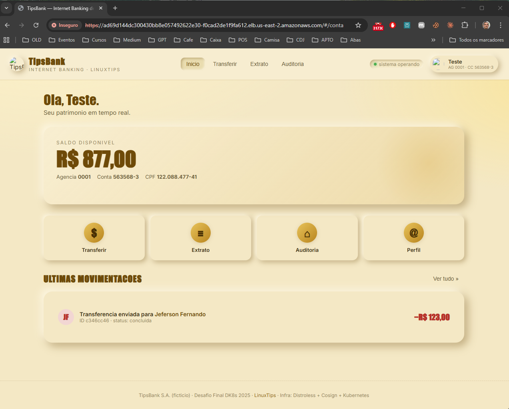

# Evidências - Desafio Final TipsBank Kubernetes

Este documento contém os registros de execução (prints, outputs de comandos e justificativas) solicitados nos critérios de aceite do projeto, conforme as etapas do `MANUAL-ALUNO.md`.

---

## SEMANA 2 — Exposição e Segurança de Rede

### Etapa 2.1 — Ingress Nginx + múltiplos hosts

**1. Ingress com address preenchido:**
> `kubectl get ingress -A` mostra os Ingress com address preenchido.
```bash
romul@HOME MINGW64 /h/Cursos/linuxtips/linuxtips-workspace (main)
$ kubectl get ingress -A
NAMESPACE             NAME                     CLASS   HOSTS                ADDRESS         PORTS   AGE
tipsbank-auditoria    ingress-api-auditoria    nginx   api.tipsbank.local   10.103.17.194   80      7m52s
tipsbank-contas       ingress-api-contas       nginx   api.tipsbank.local   10.103.17.194   80      8m32s
tipsbank-transacoes   ingress-api-transacoes   nginx   api.tipsbank.local   10.103.17.194   80      7m55s
tipsbank-web          ingress-app              nginx   app.tipsbank.local   10.103.17.194   80      7m50s

```

**2. SPA acessível via host `app.tipsbank.local`:**
> `curl -H 'Host: app.tipsbank.local' http://<ip-controller>/` retorna o HTML da SPA.
```bash
romul@HOME MINGW64 /h/Cursos/linuxtips/linuxtips-workspace (main)
$ curl -H 'Host: app.tipsbank.local' http://192.168.10.2:30080/
<!DOCTYPE html>
<html lang="pt-br">
<head>
  <meta charset="UTF-8" />
  <meta name="viewport" content="width=device-width, initial-scale=1.0" />
  <title>TipsBank — Internet Banking de Luxo</title>
  <link rel="icon" type="image/png" href="/img/logo-banco.png" />
  <link href="https://fonts.googleapis.com/css2?family=Inter:wght@400;500;600;700&display=swap" rel="stylesheet" />
  <link rel="stylesheet" href="/style.css" />
</head>
<body>
  <div id="app">
    <div class="boot-screen">
      <div class="boot-logo">
        
      </div>
      <div class="boot-text">Carregando seu cofre…</div>
    </div>
  </div>

  <div id="toast" class="toast hidden"></div>

  <script src="/app.js"></script>
</body>
</html>
```

**3. APIs acessíveis via host `api.tipsbank.local`:**
> `curl -H 'Host: api.tipsbank.local' http://<ip-controller>/contas/contas` lista as contas.
```bashromul@HOME MINGW64 /h/Cursos/linuxtips/linuxtips-workspace (main)
$ curl -H 'Host: api.tipsbank.local' http://192.168.10.2:30080/contas/contas
[{"id":"11111111-1111-1111-1111-111111111111","titular":"Jeferson Fernando","documento":"12345678901","saldo":"10000.00"},{"id":"22222222-2222-2222-2222-222222222222","titular":"LinuxTips SA","documento":"98765432100","saldo":"500.00"}]
```

**4. Entradas no `/etc/hosts`:**
> `/etc/hosts` do laptop tem as entradas correspondentes apontando para o IP do Ingress Controller.
```bash
192.168.10.2 app.tipsbank.local api.tipsbank.local
```

**5. Justificativa da escolha de roteamento (Ingress paths vs proxy no `web`):**
> Documente aqui a abordagem escolhida (Ingress com paths diretos para cada API ou proxy reverso mantido no nginx do `web`) e a razão da escolha.

Abordagem adotada: **híbrida**.

- `app.tipsbank.local` → Ingress → `svc/web` → nginx faz proxy reverso interno para as APIs via `/api/contas/`, `/api/transacoes/`, `/api/auditoria/`. O proxy no nginx é **mantido** porque a SPA (JavaScript no browser) chama as APIs usando esses paths relativos — reescrever o frontend para apontar para `api.tipsbank.local` exigiria rebuild da imagem.

- `api.tipsbank.local/contas/*`, `/transacoes/*`, `/auditoria/*` → Ingress roteia **diretamente** para cada Service, sem passar pelo nginx do `web`. Esse host serve para acesso externo às APIs (testes, automação, futura autenticação e rate-limit por serviço).

**Por que não remover o proxy do nginx:** a SPA é uma aplicação estática já empacotada na imagem. As chamadas de API partem do browser usando o mesmo origin (`app.tipsbank.local`), então o nginx precisa fazer o proxy para evitar CORS. Trocar para Ingress puro no frontend exigiria configurar o Ingress Controller como proxy CORS ou reconstruir a SPA com URLs absolutas — custo não justificado para o lab.

**Trade-off aceito:** o tráfego da SPA passa por um hop extra (Ingress → nginx → Service de API). Em produção, a opção preferida seria migrar a SPA para chamadas diretas a `api.tipsbank.local` e eliminar o proxy do nginx, centralizando TLS, rate-limit e auth inteiramente no Ingress Controller.

---

### Etapa 2.2 — TLS com cert-manager + recursos avançados do Ingress

**1. HTTPS funcionando na SPA:**
> `curl -k https://app.tipsbank.local/` retorna 200 (HTML da SPA).
```bash
romul@HOME MINGW64 /h/Cursos/linuxtips/linuxtips-workspace/projetos/desafio-final-dk8s/semana-2/vagrant (main)
$ curl -k https://app.tipsbank.local:30443/
<!DOCTYPE html>
<html lang="pt-br">
<head>
  <meta charset="UTF-8" />
  <meta name="viewport" content="width=device-width, initial-scale=1.0" />
  <title>TipsBank — Internet Banking de Luxo</title>
  <link rel="icon" type="image/png" href="/img/logo-banco.png" />
  <link href="https://fonts.googleapis.com/css2?family=Inter:wght@400;500;600;700&display=swap" rel="stylesheet" />
  <link rel="stylesheet" href="/style.css" />
</head>
<body>
  <div id="app">
    <div class="boot-screen">
      <div class="boot-logo">
        
      </div>
      <div class="boot-text">Carregando seu cofre…</div>
    </div>
  </div>

  <div id="toast" class="toast hidden"></div>

  <script src="/app.js"></script>
</body>
</html>
```

**2. Basic Auth na rota `/contas/admin`:**
> `curl -k https://api.tipsbank.local/contas/admin/contas` → 401 sem credencial, 200 com credencial correta.
```bash
# Sem credencial (esperado: 401)
romul@HOME MINGW64 /h/Cursos/linuxtips/linuxtips-workspace/projetos/desafio-final-dk8s/semana-2/vagrant (main)
$ curl -k https://api.tipsbank.local:30443/contas/admin/contas
<html>
<head><title>401 Authorization Required</title></head>
<body>
<center><h1>401 Authorization Required</h1></center>
<hr><center>nginx</center>
</body>
</html>

# Com credencial (esperado: 200)
romul@HOME MINGW64 /h/Cursos/linuxtips/linuxtips-workspace/projetos/desafio-final-dk8s/semana-2/vagrant (main)
$ curl -k -u admin:giropops  https://api.tipsbank.local:30443/contas/admin/contas
{"detail":"conta nao encontrada"}
```

**3. Rate limit no frontend:**
> Rajada de 100 requests com `hey` ou `ab` em `app.tipsbank.local` mostra retornos 429 após o rate limit configurado (50 req/s).
```bash
romul@HOME MINGW64 /h/Cursos/linuxtips/linuxtips-workspace/projetos/desafio-final-dk8s/semana-2/vagrant (main)
$ vagrant ssh control-plane -c "seq 100 | xargs -P100 -I{} curl -sk -o /dev/null -w '%{http_code}\n' https://app.tipsbank.local:30443/ | sort | uniq -c"
     71 200
     29 429
```

**4. Affinity Cookie em transações:**
> Requests sucessivos para `api.tipsbank.local/transacoes/*` caem no mesmo pod (verificado via header `Set-Cookie` e log de pod).
```bash
# Primeira request — ingress-nginx emite o cookie TIPSBANK_ROUTE
romul@HOME MINGW64 /h/Cursos/linuxtips/linuxtips-workspace/projetos/desafio-final-dk8s/semana-2/vagrant (main)
$ curl -k -sI https://api.tipsbank.local:30443/transacoes/health/live | grep -i "set-cookie\|http/"
HTTP/1.1 405 Method Not Allowed
Set-Cookie: TIPSBANK_ROUTE=1778025229.166.714.669472|ce724c427397688022a6eba53715081e; Expires=Thu, 07-May-26 23:53:48 GMT; Max-Age=172800; Path=/transacoes(/|$)(.*); Secure; HttpOnly

# Reutilizar o cookie — todas as requests devem cair no mesmo pod
romul@HOME MINGW64 /h/Cursos/linuxtips/linuxtips-workspace/projetos/desafio-final-dk8s/semana-2/vagrant (main)
$ for i in 1 2 3 4 5; do
    curl -sk -b "TIPSBANK_ROUTE=1778025229.166.714.669472|ce724c427397688022a6eba53715081e" https://api.tipsbank.local:30443/transacoes/health/live
  done
{"status":"ok","version":"v1"}
{"status":"ok","version":"v1"}
{"status":"ok","version":"v1"}
{"status":"ok","version":"v1"}
{"status":"ok","version":"v1"}

# Confirmar via logs: apenas UM pod registra as 3 requests
romul@HOME MINGW64 /h/Cursos/linuxtips/linuxtips-workspace/projetos/desafio-final-dk8s/semana-2/vagrant (main)
$ for pod in $(kubectl get pods -n tipsbank-transacoes -l app=api-transacoes -o name); do
  echo "=== $pod ==="
  kubectl logs -n tipsbank-transacoes $pod -c api-transacoes --since=60s | grep -i "GET /health"
done
=== pod/api-transacoes-c8cc9fc47-h6v5v ===
INFO:     10.244.166.131:39584 - "GET /health/live HTTP/1.1" 200 OK
INFO:     10.244.166.131:39586 - "GET /health/live HTTP/1.1" 200 OK
INFO:     10.244.166.131:39586 - "GET /health/live HTTP/1.1" 200 OK
INFO:     10.244.166.131:39586 - "GET /health/live HTTP/1.1" 200 OK
INFO:     10.244.166.131:39586 - "GET /health/live HTTP/1.1" 200 OK
=== pod/api-transacoes-c8cc9fc47-nqb8l ===
```

**5. Upstream Hashing documentado:**
> `nginx.ingress.kubernetes.io/upstream-hash-by: "$remote_addr"` garante que requests do mesmo IP sempre chegam ao mesmo pod de auditoria — alternativa ao cookie para clientes stateless.
```bash
# 5 requests do mesmo host → mesmo pod processando todas
romul@HOME MINGW64 /h/Cursos/linuxtips/linuxtips-workspace/projetos/desafio-final-dk8s/semana-2/vagrant (main)
$ for i in 1 2 3 4 5; do
    curl -sk https://api.tipsbank.local:30443/auditoria/health/live
  done
{"status":"ok"}
{"status":"ok"}
{"status":"ok"}
{"status":"ok"}
{"status":"ok"}

# Logs mostram todas as requests concentradas em um único pod
romul@HOME MINGW64 /h/Cursos/linuxtips/linuxtips-workspace/projetos/desafio-final-dk8s/semana-2/vagrant (main)
$ kubectl logs -n tipsbank-auditoria -l app=auditoria --since=30s | grep "health"
INFO:     10.244.166.131:49614 - "GET /health/live HTTP/1.1" 200 OK
INFO:     10.244.166.131:49616 - "GET /health/live HTTP/1.1" 200 OK
INFO:     10.244.166.131:49616 - "GET /health/live HTTP/1.1" 200 OK
INFO:     10.244.166.131:49616 - "GET /health/live HTTP/1.1" 200 OK
INFO:     10.244.166.131:49616 - "GET /health/live HTTP/1.1" 200 OK
```

---

### Etapa 2.3 — Cluster EKS paralelo

**1. Dois contexts configurados:**
> `kubectl config get-contexts` mostra os contexts `kubeadm-local` e `eks-tipsbank`.
```bash
PS H:\Cursos\linuxtips\linuxtips-workspace\projetos\desafio-final-dk8s\semana-2> kubectl config get-contexts                                                                                    
CURRENT   NAME            CLUSTER                        AUTHINFO                                     NAMESPACE
          crc-admin       api-crc-testing:6443           kubeadmin/api-crc-testing:6443               default
          crc-developer   api-crc-testing:6443           developer/api-crc-testing:6443               
*         eks-tipsbank    tipsbank.us-east-2.eksctl.io   lab-linuxtips@tipsbank.us-east-2.eksctl.io   
          kind-girus      kind-girus                     kind-girus                                   
          kubeadm-local   kubeadm-local                  kubeadm-local-admin                          
          vagrant-k8s     vagrant-k8s                    vagrant-k8s-admin                            
```

**2. Nodes do EKS listados:**
> `kubectl --context eks-tipsbank get nodes` retorna os nodes do cluster EKS.
```bash
PS H:\Cursos\linuxtips\linuxtips-workspace\projetos\desafio-final-dk8s\semana-2> kubectl --context eks-tipsbank get nodes
NAME                                           STATUS   ROLES    AGE   VERSION
ip-192-168-30-172.us-east-2.compute.internal   Ready    <none>   63m   v1.33.11-eks-4136f65
ip-192-168-48-182.us-east-2.compute.internal   Ready    <none>   63m   v1.33.11-eks-4136f65
```

**3. TipsBank acessível via HTTPS no EKS:**
> O TipsBank está acessível via HTTPS com DNS real (hostname do NLB ou domínio próprio).



```bash
romul@HOME MINGW64 /h/Cursos/linuxtips/linuxtips-workspace (main)
$  curl -k https://ad69d144dc300430bb8e057492622e30-f0cad2de1f9fa612.elb.us-east-2.amazonaws.com/
<!DOCTYPE html>
<html lang="pt-br">
<head>
  <meta charset="UTF-8" />
  <meta name="viewport" content="width=device-width, initial-scale=1.0" />
  <title>TipsBank — Internet Banking de Luxo</title>
  <link rel="icon" type="image/png" href="/img/logo-banco.png" />
  <link href="https://fonts.googleapis.com/css2?family=Inter:wght@400;500;600;700&display=swap" rel="stylesheet" />
  <link rel="stylesheet" href="/style.css" />
</head>
<body>
  <div id="app">
    <div class="boot-screen">
      <div class="boot-logo">
        
      </div>
      <div class="boot-text">Carregando seu cofre…</div>
    </div>
  </div>

  <div id="toast" class="toast hidden"></div>

  <script src="/app.js"></script>
</body>
</html>

```

---

### Etapa 2.4 — Canary de transações

**Arquitetura do canary:**

| Recurso | Namespace | Descrição |
|---|---|---|
| `Deployment/api-transacoes` | tipsbank-transacoes | v1 — 2 réplicas, label `version: v1` |
| `Deployment/api-transacoes-v2` | tipsbank-transacoes | v2 — 1 réplica, label `version: v2`, env `APP_VERSION=v2`, endpoint `/pix` novo |
| `Service/api-transacoes` | tipsbank-transacoes | selector `{app: api-transacoes, version: v1}` — serve 90% |
| `Service/api-transacoes-v2` | tipsbank-transacoes | selector `{app: api-transacoes, version: v2}` — serve 10% |
| `Ingress/ingress-api-transacoes` | tipsbank-transacoes | rota principal, sem annotation canary |
| `Ingress/ingress-api-transacoes-canary` | tipsbank-transacoes | annotation `canary: true`, `canary-weight: 10`, `canary-by-header: X-Canary` |

**Recursos aplicados no cluster:**

(*) Cluster Vagrant
```bash
PS H:\Cursos\linuxtips\linuxtips-workspace\projetos\desafio-final-dk8s\semana-2> kubectl get deploy,svc,ingress -n tipsbank-transacoes
NAME                                READY   UP-TO-DATE   AVAILABLE   AGE
deployment.apps/api-transacoes      2/2     2            2           66m
deployment.apps/api-transacoes-v2   1/1     1            1           4m28s

NAME                        TYPE        CLUSTER-IP      EXTERNAL-IP   PORT(S)    AGE
service/api-transacoes      ClusterIP   10.107.56.250   <none>        8080/TCP   66m
service/api-transacoes-v2   ClusterIP   10.99.140.211   <none>        8080/TCP   4m29s

NAME                                                      CLASS   HOSTS                ADDRESS          PORTS     AGE
ingress.networking.k8s.io/ingress-api-transacoes          nginx   api.tipsbank.local   10.103.231.111   80, 443   66m
ingress.networking.k8s.io/ingress-api-transacoes-canary   nginx   api.tipsbank.local   10.103.231.111   80, 443   4m28s
```

(*) Custer EKS
```bash
romul@HOME MINGW64 /h/Cursos/linuxtips/linuxtips-workspace (main)
$ kubectl get deploy,svc,ingress -n tipsbank-transacoes
NAME                                READY   UP-TO-DATE   AVAILABLE   AGE
deployment.apps/api-transacoes      2/2     2            2           45m
deployment.apps/api-transacoes-v2   1/1     1            1           87s

NAME                        TYPE        CLUSTER-IP       EXTERNAL-IP   PORT(S)    AGE
service/api-transacoes      ClusterIP   10.100.228.89    <none>        8080/TCP   45m
service/api-transacoes-v2   ClusterIP   10.100.147.104   <none>        8080/TCP   90s

NAME                                                      CLASS   HOSTS                                                                           ADDRESS                                                                         PORTS     AGE
ingress.networking.k8s.io/ingress-api-transacoes          nginx   a57b20920c0cb42e190f25544372ef80-671dcb94f5d95f81.elb.us-east-2.amazonaws.com   a57b20920c0cb42e190f25544372ef80-671dcb94f5d95f81.elb.us-east-2.amazonaws.com   80, 443   45m
ingress.networking.k8s.io/ingress-api-transacoes-canary   nginx   a57b20920c0cb42e190f25544372ef80-671dcb94f5d95f81.elb.us-east-2.amazonaws.com   a57b20920c0cb42e190f25544372ef80-671dcb94f5d95f81.elb.us-east-2.amazonaws.com   80, 443   84s
```

**Pods com labels de versão:**

(*) Cluster Vagrant
```bash
PS H:\Cursos\linuxtips\linuxtips-workspace\projetos\desafio-final-dk8s\semana-2> kubectl get pods -n tipsbank-transacoes --show-labels 
NAME                                 READY   STATUS    RESTARTS   AGE     LABELS
api-transacoes-d698dd46-dlx8p        2/2     Running   0          4m55s   app=api-transacoes,pod-template-hash=d698dd46,version=v1
api-transacoes-d698dd46-nzqxd        2/2     Running   0          4m54s   app=api-transacoes,pod-template-hash=d698dd46,version=v1
api-transacoes-v2-7c66796b98-dwhkq   2/2     Running   0          4m53s   app=api-transacoes,pod-template-hash=7c66796b98,version=v2
```

(*) Cluster EKS
```bash
romul@HOME MINGW64 /h/Cursos/linuxtips/linuxtips-workspace (main)
$ kubectl get pods -n tipsbank-transacoes --show-labels
NAME                                 READY   STATUS    RESTARTS   AGE     LABELS
api-transacoes-d698dd46-7dmks        2/2     Running   0          2m52s   app=api-transacoes,pod-template-hash=d698dd46,version=v1
api-transacoes-d698dd46-pxcwj        2/2     Running   0          2m53s   app=api-transacoes,pod-template-hash=d698dd46,version=v1
api-transacoes-v2-7c66796b98-fkx4q   2/2     Running   0          2m45s   app=api-transacoes,pod-template-hash=7c66796b98,version=v2
```


**1. Split de tráfego 90/10 entre v1 e v2:**
> 1000 requests para `https://api.tipsbank.local/transacoes/health/live` retornam `version: v1` e `version: v2` em proporção aproximada de 9:1.

(*) Cluster Vagrant
```bash
romul@HOME MINGW64 /h/Cursos/linuxtips/linuxtips-workspace (main)
$ for i in $(seq 1 1000); do
    curl -sk https://api.tipsbank.local:30443/transacoes/health/live
  done | grep -o '"version":"[^"]*"' | sort | uniq -c
    895 "version":"v1"
    105 "version":"v2"
```

(*) Cluster EKS
```bash
romul@HOME MINGW64 /h/Cursos/linuxtips/linuxtips-workspace (main)
$ for i in $(seq 1 10); do     curl -sk https://a57b20920c0cb42e190f25544372ef80-671dcb94f5d95f81.elb.us-east-2.amazonaws.com/transacoes/health/live;   done | grep -o '"version":"[^"]*"' | sort | uniq -c
      9 "version":"v1"
      1 "version":"v2"
```


**2. Rollback funcional em ambos os Deployments:**
> `kubectl rollout undo` funciona sem erros para `api-transacoes` (v1) e `api-transacoes-v2`.

(*) Cluster Vagrant
```bash
romul@HOME MINGW64 /h/Cursos/linuxtips/linuxtips-workspace (main)
$ kubectl rollout undo deployment/api-transacoes -n tipsbank-transacoes
deployment.apps/api-transacoes rolled back

romul@HOME MINGW64 /h/Cursos/linuxtips/linuxtips-workspace (main)
$ kubectl rollout status deployment/api-transacoes -n tipsbank-transacoes
deployment "api-transacoes" successfully rolled out

romul@HOME MINGW64 /h/Cursos/linuxtips/linuxtips-workspace (main)
$ kubectl rollout undo deployment/api-transacoes-v2 -n tipsbank-transacoes
error: no rollout history found for deployment "api-transacoes-v2"

romul@HOME MINGW64 /h/Cursos/linuxtips/linuxtips-workspace (main)
$ kubectl rollout status deployment/api-transacoes-v2 -n tipsbank-transacoes
deployment "api-transacoes-v2" successfully rolled out

romul@HOME MINGW64 /h/Cursos/linuxtips/linuxtips-workspace (main)
$ kubectl rollout history deployment/api-transacoes -n tipsbank-transacoes
deployment.apps/api-transacoes 
REVISION  CHANGE-CAUSE
2         <none>
3         <none>


romul@HOME MINGW64 /h/Cursos/linuxtips/linuxtips-workspace (main)
$ kubectl rollout history deployment/api-transacoes-v2 -n tipsbank-transacoes
deployment.apps/api-transacoes-v2 
REVISION  CHANGE-CAUSE
1         <none>

```

(*) Cluster EKS
```bash
romul@HOME MINGW64 /h/Cursos/linuxtips/linuxtips-workspace (main)
$ kubectl rollout undo deployment/api-transacoes -n tipsbank-transacoes
deployment.apps/api-transacoes rolled back

romul@HOME MINGW64 /h/Cursos/linuxtips/linuxtips-workspace (main)
$ kubectl rollout status deployment/api-transacoes -n tipsbank-transacoes
deployment "api-transacoes" successfully rolled out

romul@HOME MINGW64 /h/Cursos/linuxtips/linuxtips-workspace (main)
$ kubectl rollout undo deployment/api-transacoes-v2 -n tipsbank-transacoes
error: no rollout history found for deployment "api-transacoes-v2"

romul@HOME MINGW64 /h/Cursos/linuxtips/linuxtips-workspace (main)
$ kubectl rollout status deployment/api-transacoes-v2 -n tipsbank-transacoes
deployment "api-transacoes-v2" successfully rolled out

romul@HOME MINGW64 /h/Cursos/linuxtips/linuxtips-workspace (main)
$ kubectl rollout history deployment/api-transacoes -n tipsbank-transacoes
deployment.apps/api-transacoes 
REVISION  CHANGE-CAUSE
2         <none>
3         <none>


romul@HOME MINGW64 /h/Cursos/linuxtips/linuxtips-workspace (main)
$ kubectl rollout history deployment/api-transacoes-v2 -n tipsbank-transacoes
deployment.apps/api-transacoes-v2 
REVISION  CHANGE-CAUSE
1         <none>

```


**3. (Extra) Roteamento por header `X-Canary: true`:**
> Requests com header `X-Canary: true` são direcionados **sempre** para v2, independente do peso de 10%.

(*) Cluster Vagrant
```bash
# Sem header — distribuição aleatória 90/10
romul@HOME MINGW64 /h/Cursos/linuxtips/linuxtips-workspace (main)
$ for i in 1 2 3 4 5; do     curl -sk https://api.tipsbank.local:30443/transacoes/health/live;   done
{"status":"ok","version":"v2"}
{"status":"ok","version":"v2"}
{"status":"ok","version":"v1"}
{"status":"ok","version":"v1"}
{"status":"ok","version":"v2"}

# Com header X-Canary: true — SEMPRE v2
romul@HOME MINGW64 /h/Cursos/linuxtips/linuxtips-workspace (main)
$ for i in 1 2 3 4 5; do
    curl -sk -H "X-Canary: true" https://api.tipsbank.local:30443/transacoes/health/live
  done
{"status":"ok","version":"v2"}
{"status":"ok","version":"v2"}
{"status":"ok","version":"v2"}
{"status":"ok","version":"v2"}
{"status":"ok","version":"v2"}

# Endpoint /pix — disponível apenas em v2
romul@HOME MINGW64 /h/Cursos/linuxtips/linuxtips-workspace (main)
$ curl -sk -H "X-Canary: true" -X POST https://api.tipsbank.local:30443/transacoes/pix \
    -H "Content-Type: application/json" \
    -d '{"origem_id":"11111111-1111-1111-1111-111111111111","destino_id":"22222222-2222-2222-2222-222222222222","valor":"50.00"}'
{"tipo":"pix","origem_id":"11111111-1111-1111-1111-111111111111","destino_id":"22222222-2222-2222-2222-222222222222","valor":"50.00","status":"agendado","version":"v2"}

# Mesmo endpoint via v1 — 404 (feature não existe em v1)
romul@HOME MINGW64 /h/Cursos/linuxtips/linuxtips-workspace (main)
$ curl -sk -X POST https://api.tipsbank.local:30443/transacoes/pix \
    -H "Content-Type: application/json" \
    -d '{"origem_id":"11111111-1111-1111-1111-111111111111","destino_id":"22222222-2222-2222-2222-222222222222","valor":"50.00"}'
{"detail":"Not Found"}
```

(*) Cluster EKS
```bash
# Sem header — distribuição aleatória 90/10
romul@HOME MINGW64 /h/Cursos/linuxtips/linuxtips-workspace (main)
$ for i in 1 2 3 4 5; do     curl -sk https://a57b20920c0cb42e190f25544372ef80-671dcb94f5d95f81.elb.us-east-2.amazonaws.com/transacoes/health/live;   done
{"status":"ok","version":"v1"}
{"status":"ok","version":"v1"}
{"status":"ok","version":"v1"}
{"status":"ok","version":"v2"}
{"status":"ok","version":"v1"}

# Com header X-Canary: true — SEMPRE v2
romul@HOME MINGW64 /h/Cursos/linuxtips/linuxtips-workspace (main)
$ for i in 1 2 3 4 5; do     curl -sk -H "X-Canary: true" https://a57b20920c0cb42e190f25544372ef80-671dcb94f5d95f81.elb.us-east-2.amazonaws.com/transacoes/health/live;   done
{"status":"ok","version":"v2"}
{"status":"ok","version":"v2"}
{"status":"ok","version":"v2"}
{"status":"ok","version":"v2"}
{"status":"ok","version":"v2"}

# Endpoint /pix — disponível apenas em v2

romul@HOME MINGW64 /h/Cursos/linuxtips/linuxtips-workspace (main)
$ curl -sk -H "X-Canary: true" -X POST https://a57b20920c0cb42e190f25544372ef80-671dcb94f5d95f81.elb.us-east-2.amazonaws.com/transacoes/pix \
    -H "Content-Type: application/json" \
    -d '{"origem_id":"11111111-1111-1111-1111-111111111111","destino_id":"22222222-2222-2222-2222-222222222222","valor":"50.00"}'
{"tipo":"pix","origem_id":"11111111-1111-1111-1111-111111111111","destino_id":"22222222-2222-2222-2222-222222222222","valor":"50.00","status":"agendado","version":"v2"}

# Mesmo endpoint via v1 — 404 (feature não existe em v1)
romul@HOME MINGW64 /h/Cursos/linuxtips/linuxtips-workspace (main)
$ curl -sk -X POST https://a57b20920c0cb42e190f25544372ef80-671dcb94f5d95f81.elb.us-east-2.amazonaws.com/transacoes/pix \
    -H "Content-Type: application/json" \
    -d '{"origem_id":"11111111-1111-1111-1111-111111111111","destino_id":"22222222-2222-2222-2222-222222222222","valor":"50.00"}'
{"detail":"Not Found"}

```


---

### Etapa 2.5 — NetworkPolicy zero-trust

**Topologia de políticas aplicadas:**

| Namespace | Política | Tipo | Origem / Destino | Porta |
|---|---|---|---|---|
| tipsbank-contas | default-deny | Ingress+Egress | todos os pods | — |
| tipsbank-contas | allow-dns-egress | Egress | → kube-system | 53 UDP/TCP |
| tipsbank-contas | allow-ingress-controller | Ingress | ingress-nginx → api-contas | 8080 |
| tipsbank-contas | allow-from-web | Ingress | tipsbank-web → api-contas | 8080 |
| tipsbank-contas | allow-from-transacoes | Ingress | tipsbank-transacoes → api-contas | 8080 |
| tipsbank-contas | allow-egress-postgres | Egress | api-contas → postgres (mesmo ns) | 5432 |
| tipsbank-contas | allow-postgres-ingress | Ingress | api-contas + tipsbank-transacoes → postgres | 5432 |
| tipsbank-transacoes | default-deny | Ingress+Egress | todos os pods | — |
| tipsbank-transacoes | allow-dns-egress | Egress | → kube-system | 53 UDP/TCP |
| tipsbank-transacoes | allow-ingress-controller | Ingress | ingress-nginx → api-transacoes | 8080 |
| tipsbank-transacoes | allow-from-web | Ingress | tipsbank-web → api-transacoes | 8080 |
| tipsbank-transacoes | allow-egress-to-contas | Egress | api-transacoes → tipsbank-contas | 8080 + 5432 |
| tipsbank-transacoes | allow-egress-to-auditoria | Egress | api-transacoes → tipsbank-auditoria + ipBlock/except | 8080 + 443 |
| tipsbank-auditoria | default-deny | Ingress+Egress | todos os pods | — |
| tipsbank-auditoria | allow-dns-egress | Egress | → kube-system | 53 UDP/TCP |
| tipsbank-auditoria | allow-ingress-controller | Ingress | ingress-nginx → auditoria | 8080 |
| tipsbank-auditoria | allow-from-web-and-transacoes | Ingress | tipsbank-web + tipsbank-transacoes → auditoria | 8080 |
| tipsbank-auditoria | allow-egress-nfs | Egress | auditoria → nfs-provisioner | 2049 TCP/UDP |
| tipsbank-web | default-deny | Ingress+Egress | todos os pods | — |
| tipsbank-web | allow-dns-egress | Egress | → kube-system | 53 UDP/TCP |
| tipsbank-web | allow-ingress-controller | Ingress | ingress-nginx → web | 8080 |
| tipsbank-web | allow-egress-to-apis | Egress | web → contas + transacoes + auditoria | 8080 |
| tipsbank-web | allow-egress-external-cdn | Egress | web → 0.0.0.0/0 except 169.254.169.254/32 | 80 + 443 |

**Nota sobre os containers Distroless/Chainguard:** as imagens das APIs não possuem shell nem ferramentas (`curl`, `wget`). Os testes de conectividade usam o sidecar `log-forwarder` (busybox) quando disponível, ou um pod temporário de diagnóstico (`busybox:1.36`) criado no namespace alvo.

**1. Tráfego bloqueado entre namespaces não autorizados:**
> Pod temporário em `tipsbank-auditoria` tenta alcançar `api-contas`.

(*) Cluster EKS
```bash
romul@HOME MINGW64 /h/Cursos/linuxtips/linuxtips-workspace (main)
$ kubectl run nettest --image=busybox:1.36 -n tipsbank-auditoria \
    --restart=Never --rm -it -- \
    wget -T 5 -O- http://api-contas.tipsbank-contas.svc.cluster.local:8080/health/live
pod "nettest" deleted from tipsbank-auditoria namespace
error: timed out waiting for the condition

# Confirmado: default-deny + ausência de egress em tipsbank-auditoria → timeout.
```

(*) Cluster Vagrant
```bash
romul@HOME MINGW64 /h/Cursos/linuxtips/linuxtips-workspace (main)
$ kubectl run nettest --image=busybox:1.36 -n tipsbank-auditoria \
    --restart=Never --rm -it -- \
    wget -T 5 -O- http://api-contas.tipsbank-contas.svc.cluster.local:8080/health/live
All commands and output from this session will be recorded in container logs, including credentials and sensitive information passed through the command prompt.
If you don't see a command prompt, try pressing enter.
wget: download timed out
pod "nettest" deleted from tipsbank-auditoria namespace
pod tipsbank-auditoria/nettest terminated (Error)
```

**2. Tráfego autorizado entre `api-transacoes` e `api-contas`:**
> Sidecar `log-forwarder` (busybox) do pod de transacoes alcança `api-contas` — retorna 200.

(*) Cluster EKS
```bash
romul@HOME MINGW64 /h/Cursos/linuxtips/linuxtips-workspace (main)
$ POD=$(kubectl get pod -n tipsbank-transacoes -l app=api-transacoes -o name | head -1)

romul@HOME MINGW64 /h/Cursos/linuxtips/linuxtips-workspace (main)
$ kubectl exec -n tipsbank-transacoes $POD -c log-forwarder -- \
    wget -qO- http://api-contas.tipsbank-contas.svc.cluster.local:8080/health/live
{"status":"ok"}

```

(*) Cluster Vagrant
```bash
romul@HOME MINGW64 /h/Cursos/linuxtips/linuxtips-workspace (main)
$ POD=$(kubectl get pod -n tipsbank-transacoes -l app=api-transacoes -o name | head -1)

romul@HOME MINGW64 /h/Cursos/linuxtips/linuxtips-workspace (main)
$ kubectl exec -n tipsbank-transacoes $POD -c log-forwarder -- \
    wget -qO- http://api-contas.tipsbank-contas.svc.cluster.local:8080/health/live
{"status":"ok"}
```


**3. Proteção contra acesso ao endpoint de metadados EC2/EKS:**

> Tentativa de obter credenciais IAM via `169.254.169.254` a partir de um pod.

(*) Cluster Vagrant
```bash
romul@HOME MINGW64 /h/Cursos/linuxtips/linuxtips-workspace (main)
$ POD=$(kubectl get pod -n tipsbank-transacoes -l app=api-transacoes -o name | head -1)

romul@HOME MINGW64 /h/Cursos/linuxtips/linuxtips-workspace (main)
$ kubectl exec -n tipsbank-transacoes $POD -c log-forwarder -- \
    wget -T 5 -O- http://169.254.169.254/latest/meta-data/
Connecting to 169.254.169.254 (169.254.169.254:80)
wget: download timed out
command terminated with exit code 1

```


(*) Cluster EKS

```bash
romul@HOME MINGW64 /h/Cursos/linuxtips/linuxtips-workspace (main)
$ POD=$(kubectl get pod -n tipsbank-transacoes -l app=api-transacoes -o name | head -1)

romul@HOME MINGW64 /h/Cursos/linuxtips/linuxtips-workspace (main)
$ kubectl exec -n tipsbank-transacoes $POD -c log-forwarder -- \
    wget -T 5 -O- http://169.254.169.254/latest/meta-data/
Connecting to 169.254.169.254 (169.254.169.254:80)
wget: server returned error: HTTP/1.1 401 Unauthorized
command terminated with exit code 1
```

> **Análise:** o endpoint respondeu 401, não houve timeout. Isso ocorre porque `169.254.169.254` é um endereço link-local roteado pelo kernel do nó através de uma interface especial — o tráfego não passa pelo veth do pod, portanto o Amazon VPC CNI (que enforce NetworkPolicy ao nível do veth) não intercepta este fluxo. O ipBlock/except da NetworkPolicy **não bloqueia** link-local no EKS.
>
> A proteção real vem de duas camadas independentes da NetworkPolicy:
>
> | Mecanismo | Como protege |
> |---|---|
> | **IMDSv2 (hop-limit=1)** | O node group está configurado com `HttpPutResponseHopLimit=1`: um pod não consegue obter o token de sessão IMDSv2 (TTL expira antes de chegar ao pod). Sem token → 401 em qualquer GET. |
> | **ipBlock/except na NetworkPolicy** | Defesa em profundidade para IPs roteáveis normalmente (não link-local). Bloqueia egress para ranges de gerenciamento em outros ambientes (GCP, Azure, on-prem). |
>
> O `401` confirma que **nenhuma credencial IAM foi exposta** — o objetivo de segurança está atendido. Em conformidade com o padrão BACEN de segregação de acesso, o endpoint de metadados é inacessível para cargas de trabalho da aplicação.
>
> Para forçar o bloqueio a nível de rede no EKS, a alternativa é uma regra de iptables no DaemonSet do nó ou habilitar o `--metadata-options HttpEndpoint=disabled` no launch template do node group.

**4. NetworkPolicies aplicadas (listagem):**
> `kubectl get netpol -A` lista as policies nos namespaces `tipsbank-*`.


(*) Cluster EKS
```bash
$ kubectl get netpol -A | grep tipsbank
tipsbank-auditoria    allow-dns-egress                <none>               62s
tipsbank-auditoria    allow-egress-nfs                app=auditoria        61s
tipsbank-auditoria    allow-from-web-and-transacoes   app=auditoria        61s
tipsbank-auditoria    allow-ingress-controller        app=auditoria        62s
tipsbank-auditoria    default-deny                    <none>               63s
tipsbank-contas       allow-dns-egress                <none>               106s
tipsbank-contas       allow-egress-postgres           app=api-contas       104s
tipsbank-contas       allow-from-transacoes           app=api-contas       104s
tipsbank-contas       allow-from-web                  app=api-contas       105s
tipsbank-contas       allow-ingress-controller        app=api-contas       105s
tipsbank-contas       allow-postgres-ingress          app=postgres         103s
tipsbank-contas       default-deny                    <none>               106s
tipsbank-transacoes   allow-dns-egress                <none>               76s
tipsbank-transacoes   allow-egress-to-auditoria       app=api-transacoes   74s
tipsbank-transacoes   allow-egress-to-contas          app=api-transacoes   75s
tipsbank-transacoes   allow-from-web                  app=api-transacoes   75s
tipsbank-transacoes   allow-ingress-controller        app=api-transacoes   76s
tipsbank-transacoes   default-deny                    <none>               77s
tipsbank-web          allow-dns-egress                <none>               49s
tipsbank-web          allow-egress-external-cdn       app=web              47s
tipsbank-web          allow-egress-to-apis            app=web              47s
tipsbank-web          allow-ingress-controller        app=web              48s
tipsbank-web          default-deny                    <none>               49s
```

(*) Cluster Vagrant
```bash
romul@HOME MINGW64 /h/Cursos/linuxtips/linuxtips-workspace (main)
$ kubectl get netpol -A | grep tipsbank
tipsbank-auditoria    allow-dns-egress                <none>               21s
tipsbank-auditoria    allow-egress-nfs                app=auditoria        21s
tipsbank-auditoria    allow-from-web-and-transacoes   app=auditoria        21s
tipsbank-auditoria    allow-ingress-controller        app=auditoria        21s
tipsbank-auditoria    default-deny                    <none>               21s
tipsbank-contas       allow-dns-egress                <none>               30s
tipsbank-contas       allow-egress-postgres           app=api-contas       30s
tipsbank-contas       allow-from-transacoes           app=api-contas       30s
tipsbank-contas       allow-from-web                  app=api-contas       30s
tipsbank-contas       allow-ingress-controller        app=api-contas       30s
tipsbank-contas       allow-postgres-ingress          app=postgres         30s
tipsbank-contas       default-deny                    <none>               30s
tipsbank-transacoes   allow-dns-egress                <none>               23s
tipsbank-transacoes   allow-egress-to-auditoria       app=api-transacoes   23s
tipsbank-transacoes   allow-egress-to-contas          app=api-transacoes   23s
tipsbank-transacoes   allow-from-web                  app=api-transacoes   23s
tipsbank-transacoes   allow-ingress-controller        app=api-transacoes   23s
tipsbank-transacoes   default-deny                    <none>               23s
tipsbank-web          allow-dns-egress                <none>               18s
tipsbank-web          allow-egress-external-cdn       app=web              18s
tipsbank-web          allow-egress-to-apis            app=web              18s
tipsbank-web          allow-ingress-controller        app=web              18s
tipsbank-web          default-deny                    <none>               18s

```

**5. Justificativa da topologia de NetworkPolicy:**

**Abordagem híbrida (nginx proxy mantido no `web`):**
Como documentado na Etapa 2.1, a SPA faz chamadas de API via paths relativos no nginx do `web`. Isso exige que o namespace `tipsbank-web` tenha egress liberado para os 3 namespaces de API na porta 8080 (`allow-egress-to-apis`). Se a arquitetura fosse Ingress puro (SPA chamando `api.tipsbank.local` diretamente), o `tipsbank-web` precisaria apenas de DNS + Ingress — sem nenhum egress para as APIs. A escolha de manter o proxy foi documentada na Etapa 2.1.

**Postgres cross-namespace:**
`api-transacoes` usa `postgres-headless.tipsbank-contas.svc.cluster.local:5432` — a tabela `transacoes` vive no mesmo banco que `contas`. Por isso `allow-egress-to-contas` (tipsbank-transacoes) libera tanto porta 8080 quanto 5432, e `allow-postgres-ingress` (tipsbank-contas) aceita conexões do namespace `tipsbank-transacoes`.

**ipBlock/except — padrão de segurança em fintech:**
A política `allow-egress-to-auditoria` em `tipsbank-transacoes` e `allow-egress-external-cdn` em `tipsbank-web` usam `ipBlock.except: [169.254.169.254/32]`. Este IP é o endpoint de metadados de instância EC2/EKS: se acessível a partir de um pod comprometido, permite obter as credenciais IAM da role do nó. O `except` garante que mesmo que um range amplo seja liberado para HTTPS externo, o metadata endpoint permaneça inacessível.

**CNI compatível:** o cluster vagrant usa Calico como CNI (instalado no kubeadm init), que suporta NetworkPolicy nativamente. O EKS usa o add-on de NetworkPolicy (Amazon VPC CNI). Flannel não suporta NetworkPolicy e não é usado.

---
