# Evidências - Desafio Final TipsBank Kubernetes

Este documento contém os registros de execução (prints, outputs de comandos e justificativas) solicitados nos critérios de aceite do projeto, conforme as etapas do `MANUAL-ALUNO.md`.

---

## SEMANA 3 — Resiliência, Scheduling, Autoscaling e Observabilidade

---

### Etapa 3.1 — Probes completas

**Objetivo**: todas as APIs com 3 probes (liveness, readiness, startup) e o Postgres com liveness + readiness + startup customizadas.

#### Verificação: probes configuradas

```
PS H:\Cursos\linuxtips\linuxtips-workspace\projetos\desafio-final-dk8s\semana-3> kubectl describe pod -n tipsbank-contas -l app=api-contas
Name:             api-contas-b5f75b974-cr2zr
Namespace:        tipsbank-contas
Priority:         0
Service Account:  default
Node:             ip-192-168-14-183.us-east-2.compute.internal/192.168.14.183
Start Time:       Tue, 12 May 2026 20:51:15 -0300
Labels:           app=api-contas
                  pod-template-hash=b5f75b974
Annotations:      <none>
Status:           Running
IP:               192.168.0.192
IPs:
  IP:           192.168.0.192
Controlled By:  ReplicaSet/api-contas-b5f75b974
Init Containers:
  wait-for-postgres:
    Container ID:  containerd://be2b0e694c026ae95394c7fa4f8bda4161d21ab277316a9af998e06f93b7b2bc
    Image:         busybox:1.36
    Image ID:      docker.io/library/busybox@sha256:73aaf090f3d85aa34ee199857f03fa3a95c8ede2ffd4cc2cdb5b94e566b11662
    Port:          <none>
    Host Port:     <none>
    Command:
      sh
      -c
      until nc -z postgres-headless 5432; do echo waiting for postgres; sleep 2; done
    State:          Terminated
      Reason:       Completed
      Exit Code:    0
      Started:      Tue, 12 May 2026 20:51:17 -0300
      Finished:     Tue, 12 May 2026 20:51:29 -0300
    Ready:          True
    Restart Count:  0
    Limits:
      cpu:     50m
      memory:  32Mi
    Requests:
      cpu:        10m
      memory:     16Mi
    Environment:  <none>
    Mounts:
      /var/run/secrets/kubernetes.io/serviceaccount from kube-api-access-qqm99 (ro)
Containers:
  api-contas:
    Container ID:   containerd://b030cad26f6ab1fb4ce475764bdb3e0c5bbe78305da8c90d0c01b9391372d7a9
    Image:          romulow22/tipsbank-api-contas:v1.0.0
    Image ID:       docker.io/romulow22/tipsbank-api-contas@sha256:c32f93e48a36e1175c6a2122f531aeff0abf9c84b5ef1ac40a92af04ac036306
    Port:           8080/TCP
    Host Port:      0/TCP
    State:          Running
      Started:      Tue, 12 May 2026 20:51:33 -0300
    Ready:          True
    Restart Count:  0
    Limits:
      cpu:     500m
      memory:  256Mi
    Requests:
      cpu:      100m
      memory:   128Mi
    Liveness:   http-get http://:8080/health/live delay=0s timeout=1s period=10s #success=1 #failure=3
    Readiness:  http-get http://:8080/health/ready delay=0s timeout=1s period=5s #success=1 #failure=3
    Startup:    http-get http://:8080/health/startup delay=0s timeout=1s period=5s #success=1 #failure=30
    Environment:
      DB_URL:     <set to the key 'DB_URL' in secret 'secret-db'>             Optional: false
      LOG_LEVEL:  <set to the key 'LOG_LEVEL' of config map 'configmap-app'>  Optional: false
    Mounts:
      /var/run/secrets/kubernetes.io/serviceaccount from kube-api-access-qqm99 (ro)
Conditions:
  Type                        Status
  PodReadyToStartContainers   True 
  Initialized                 True 
  Ready                       True 
  ContainersReady             True 
  PodScheduled                True 
Volumes:
  kube-api-access-qqm99:
    Type:                    Projected (a volume that contains injected data from multiple sources)
    TokenExpirationSeconds:  3607
    ConfigMapName:           kube-root-ca.crt
    Optional:                false
    DownwardAPI:             true
QoS Class:                   Burstable
Node-Selectors:              <none>
Tolerations:                 node.kubernetes.io/not-ready:NoExecute op=Exists for 300s
                             node.kubernetes.io/unreachable:NoExecute op=Exists for 300s
Events:                      <none>


Name:             api-contas-b5f75b974-kp8gg
Namespace:        tipsbank-contas
Priority:         0
Service Account:  default
Node:             ip-192-168-82-151.us-east-2.compute.internal/192.168.82.151
Start Time:       Tue, 12 May 2026 20:51:15 -0300
Labels:           app=api-contas
                  pod-template-hash=b5f75b974
Annotations:      <none>
Status:           Running
IP:               192.168.95.171
IPs:
  IP:           192.168.95.171
Controlled By:  ReplicaSet/api-contas-b5f75b974
Init Containers:
  wait-for-postgres:
    Container ID:  containerd://4728223f881a7c9d0353181202319094e9c4b9a9bee41ed4a4144eae3719960b
    Image:         busybox:1.36
    Image ID:      docker.io/library/busybox@sha256:73aaf090f3d85aa34ee199857f03fa3a95c8ede2ffd4cc2cdb5b94e566b11662
    Port:          <none>
    Host Port:     <none>
    Command:
      sh
      -c
      until nc -z postgres-headless 5432; do echo waiting for postgres; sleep 2; done
    State:          Terminated
      Reason:       Completed
      Exit Code:    0
      Started:      Tue, 12 May 2026 20:51:17 -0300
      Finished:     Tue, 12 May 2026 20:51:29 -0300
    Ready:          True
    Restart Count:  0
    Limits:
      cpu:     50m
      memory:  32Mi
    Requests:
      cpu:        10m
      memory:     16Mi
    Environment:  <none>
    Mounts:
      /var/run/secrets/kubernetes.io/serviceaccount from kube-api-access-v6szv (ro)
Containers:
  api-contas:
    Container ID:   containerd://39315f6661b20ab97ee22a6248a430bd33b079b587ccb9aec274b07cbfdc259b
    Image:          romulow22/tipsbank-api-contas:v1.0.0
    Image ID:       docker.io/romulow22/tipsbank-api-contas@sha256:c32f93e48a36e1175c6a2122f531aeff0abf9c84b5ef1ac40a92af04ac036306
    Port:           8080/TCP
    Host Port:      0/TCP
    State:          Running
      Started:      Tue, 12 May 2026 20:51:33 -0300
    Ready:          True
    Restart Count:  0
    Limits:
      cpu:     500m
      memory:  256Mi
    Requests:
      cpu:      100m
      memory:   128Mi
    Liveness:   http-get http://:8080/health/live delay=0s timeout=1s period=10s #success=1 #failure=3
    Readiness:  http-get http://:8080/health/ready delay=0s timeout=1s period=5s #success=1 #failure=3
    Startup:    http-get http://:8080/health/startup delay=0s timeout=1s period=5s #success=1 #failure=30
    Environment:
      DB_URL:     <set to the key 'DB_URL' in secret 'secret-db'>             Optional: false
      LOG_LEVEL:  <set to the key 'LOG_LEVEL' of config map 'configmap-app'>  Optional: false
    Mounts:
      /var/run/secrets/kubernetes.io/serviceaccount from kube-api-access-v6szv (ro)
Conditions:
  Type                        Status
  PodReadyToStartContainers   True 
  Initialized                 True 
  Ready                       True 
  ContainersReady             True 
  PodScheduled                True 
Volumes:
  kube-api-access-v6szv:
    Type:                    Projected (a volume that contains injected data from multiple sources)
    TokenExpirationSeconds:  3607
    ConfigMapName:           kube-root-ca.crt
    Optional:                false
    DownwardAPI:             true
QoS Class:                   Burstable
Node-Selectors:              <none>
Tolerations:                 node.kubernetes.io/not-ready:NoExecute op=Exists for 300s
                             node.kubernetes.io/unreachable:NoExecute op=Exists for 300s
Events:                      <none>

PS H:\Cursos\linuxtips\linuxtips-workspace\projetos\desafio-final-dk8s\semana-3> kubectl describe pod -n tipsbank-transacoes -l app=api-transacoes
Name:             api-transacoes-6d46c777c5-h9z7q
Namespace:        tipsbank-transacoes
Priority:         0
Service Account:  default
Node:             ip-192-168-82-151.us-east-2.compute.internal/192.168.82.151
Start Time:       Tue, 12 May 2026 20:51:43 -0300
Labels:           app=api-transacoes
                  pod-template-hash=6d46c777c5
                  version=v1
Annotations:      <none>
Status:           Running
IP:               192.168.85.225
IPs:
  IP:           192.168.85.225
Controlled By:  ReplicaSet/api-transacoes-6d46c777c5
Containers:
  api-transacoes:
    Container ID:   containerd://a8eb1958a8fc35944730edb686a383b7058f11fd73f4b4287af6b74c353322de
    Image:          romulow22/tipsbank-api-transacoes:v1.1.0
    Image ID:       docker.io/romulow22/tipsbank-api-transacoes@sha256:b97981c1b9dfa88137b7893819f7e5b0b4189172be258c1097fdaa332ee2f40d
    Port:           8080/TCP
    Host Port:      0/TCP
    State:          Running
      Started:      Tue, 12 May 2026 20:51:46 -0300
    Ready:          True
    Restart Count:  0
    Limits:
      cpu:     500m
      memory:  256Mi
    Requests:
      cpu:      100m
      memory:   128Mi
    Liveness:   http-get http://:8080/health/live delay=0s timeout=1s period=10s #success=1 #failure=3
    Readiness:  http-get http://:8080/health/ready delay=0s timeout=1s period=5s #success=1 #failure=3
    Startup:    http-get http://:8080/health/startup delay=0s timeout=1s period=5s #success=1 #failure=30
    Environment:
      DB_URL:         <set to the key 'DB_URL' in secret 'secret-db'>                 Optional: false
      CONTAS_URL:     <set to the key 'CONTAS_URL' of config map 'configmap-app'>     Optional: false
      AUDITORIA_URL:  <set to the key 'AUDITORIA_URL' of config map 'configmap-app'>  Optional: false
      APP_VERSION:    <set to the key 'APP_VERSION' of config map 'configmap-app'>    Optional: false
      LOG_LEVEL:      <set to the key 'LOG_LEVEL' of config map 'configmap-app'>      Optional: false
      LOG_FILE:       <set to the key 'LOG_FILE' of config map 'configmap-app'>       Optional: false
    Mounts:
      /var/log/app from app-logs (rw)
      /var/run/secrets/kubernetes.io/serviceaccount from kube-api-access-rqgbg (ro)
  log-forwarder:
    Container ID:  containerd://a590cc8b0fae49ed2ac275a927aaf648a2d25b016013d9c919681a55d02bb359
    Image:         busybox:1.36
    Image ID:      docker.io/library/busybox@sha256:73aaf090f3d85aa34ee199857f03fa3a95c8ede2ffd4cc2cdb5b94e566b11662
    Port:          <none>
    Host Port:     <none>
    Command:
      sh
      -c
      tail -F /var/log/app/app.log 2>/dev/null || (sleep 2 && tail -F /var/log/app/app.log)
    State:          Running
      Started:      Tue, 12 May 2026 20:51:46 -0300
    Ready:          True
    Restart Count:  0
    Limits:
      cpu:     50m
      memory:  32Mi
    Requests:
      cpu:        10m
      memory:     16Mi
    Environment:  <none>
    Mounts:
      /var/log/app from app-logs (rw)
      /var/run/secrets/kubernetes.io/serviceaccount from kube-api-access-rqgbg (ro)
Conditions:
  Type                        Status
  PodReadyToStartContainers   True 
  Initialized                 True 
  Ready                       True 
  ContainersReady             True 
  PodScheduled                True 
Volumes:
  app-logs:
    Type:       EmptyDir (a temporary directory that shares a pod's lifetime)
    Medium:     
    SizeLimit:  <unset>
  kube-api-access-rqgbg:
    Type:                    Projected (a volume that contains injected data from multiple sources)
    TokenExpirationSeconds:  3607
    ConfigMapName:           kube-root-ca.crt
    Optional:                false
    DownwardAPI:             true
QoS Class:                   Burstable
Node-Selectors:              <none>
Tolerations:                 node.kubernetes.io/not-ready:NoExecute op=Exists for 300s
                             node.kubernetes.io/unreachable:NoExecute op=Exists for 300s
Events:                      <none>


Name:             api-transacoes-6d46c777c5-qxt75
Namespace:        tipsbank-transacoes
Priority:         0
Service Account:  default
Node:             ip-192-168-14-183.us-east-2.compute.internal/192.168.14.183
Start Time:       Tue, 12 May 2026 20:51:43 -0300
Labels:           app=api-transacoes
                  pod-template-hash=6d46c777c5
                  version=v1
Annotations:      <none>
Status:           Running
IP:               192.168.28.150
IPs:
  IP:           192.168.28.150
Controlled By:  ReplicaSet/api-transacoes-6d46c777c5
Containers:
  api-transacoes:
    Container ID:   containerd://63550a459f8991bbfb37729ddd36f69cb85d83b08150ff684b1fd3acaae681c1
    Image:          romulow22/tipsbank-api-transacoes:v1.1.0
    Image ID:       docker.io/romulow22/tipsbank-api-transacoes@sha256:b97981c1b9dfa88137b7893819f7e5b0b4189172be258c1097fdaa332ee2f40d
    Port:           8080/TCP
    Host Port:      0/TCP
    State:          Running
      Started:      Tue, 12 May 2026 20:51:46 -0300
    Ready:          True
    Restart Count:  0
    Limits:
      cpu:     500m
      memory:  256Mi
    Requests:
      cpu:      100m
      memory:   128Mi
    Liveness:   http-get http://:8080/health/live delay=0s timeout=1s period=10s #success=1 #failure=3
    Readiness:  http-get http://:8080/health/ready delay=0s timeout=1s period=5s #success=1 #failure=3
    Startup:    http-get http://:8080/health/startup delay=0s timeout=1s period=5s #success=1 #failure=30
    Environment:
      DB_URL:         <set to the key 'DB_URL' in secret 'secret-db'>                 Optional: false
      CONTAS_URL:     <set to the key 'CONTAS_URL' of config map 'configmap-app'>     Optional: false
      AUDITORIA_URL:  <set to the key 'AUDITORIA_URL' of config map 'configmap-app'>  Optional: false
      APP_VERSION:    <set to the key 'APP_VERSION' of config map 'configmap-app'>    Optional: false
      LOG_LEVEL:      <set to the key 'LOG_LEVEL' of config map 'configmap-app'>      Optional: false
      LOG_FILE:       <set to the key 'LOG_FILE' of config map 'configmap-app'>       Optional: false
    Mounts:
      /var/log/app from app-logs (rw)
      /var/run/secrets/kubernetes.io/serviceaccount from kube-api-access-hpwhh (ro)
  log-forwarder:
    Container ID:  containerd://799dc9460af24a42bea57ddf1029ce44496305c000dc2761439f942521857f52
    Image:         busybox:1.36
    Image ID:      docker.io/library/busybox@sha256:73aaf090f3d85aa34ee199857f03fa3a95c8ede2ffd4cc2cdb5b94e566b11662
    Port:          <none>
    Host Port:     <none>
    Command:
      sh
      -c
      tail -F /var/log/app/app.log 2>/dev/null || (sleep 2 && tail -F /var/log/app/app.log)
    State:          Running
      Started:      Tue, 12 May 2026 20:51:46 -0300
    Ready:          True
    Restart Count:  0
    Limits:
      cpu:     50m
      memory:  32Mi
    Requests:
      cpu:        10m
      memory:     16Mi
    Environment:  <none>
    Mounts:
      /var/log/app from app-logs (rw)
      /var/run/secrets/kubernetes.io/serviceaccount from kube-api-access-hpwhh (ro)
Conditions:
  Type                        Status
  PodReadyToStartContainers   True 
  Initialized                 True 
  Ready                       True 
  ContainersReady             True 
  PodScheduled                True 
Volumes:
  app-logs:
    Type:       EmptyDir (a temporary directory that shares a pod's lifetime)
    Medium:     
    SizeLimit:  <unset>
  kube-api-access-hpwhh:
    Type:                    Projected (a volume that contains injected data from multiple sources)
    TokenExpirationSeconds:  3607
    ConfigMapName:           kube-root-ca.crt
    Optional:                false
    DownwardAPI:             true
QoS Class:                   Burstable
Node-Selectors:              <none>
Tolerations:                 node.kubernetes.io/not-ready:NoExecute op=Exists for 300s
                             node.kubernetes.io/unreachable:NoExecute op=Exists for 300s
Events:                      <none>


Name:             api-transacoes-v2-7c66796b98-g6p82
Namespace:        tipsbank-transacoes
Priority:         0
Service Account:  default
Node:             ip-192-168-14-183.us-east-2.compute.internal/192.168.14.183
Start Time:       Tue, 12 May 2026 20:51:51 -0300
Labels:           app=api-transacoes
                  pod-template-hash=7c66796b98
                  version=v2
Annotations:      <none>
Status:           Running
IP:               192.168.7.166
IPs:
  IP:           192.168.7.166
Controlled By:  ReplicaSet/api-transacoes-v2-7c66796b98
Containers:
  api-transacoes:
    Container ID:   containerd://a03dcbe3ddfa33f2c13f0674677d95200c8a5931b827569d9f172d71df8ddafd
    Image:          romulow22/tipsbank-api-transacoes:v2.0.0
    Image ID:       docker.io/romulow22/tipsbank-api-transacoes@sha256:a017fa0d43387a1a9ef9b9aaf1c1c48e32537ac26eff56b61194fd7e2708a6bc
    Port:           8080/TCP
    Host Port:      0/TCP
    State:          Running
      Started:      Tue, 12 May 2026 20:51:55 -0300
    Ready:          True
    Restart Count:  0
    Limits:
      cpu:     500m
      memory:  256Mi
    Requests:
      cpu:     100m
      memory:  128Mi
    Environment:
      DB_URL:         <set to the key 'DB_URL' in secret 'secret-db'>                 Optional: false
      CONTAS_URL:     <set to the key 'CONTAS_URL' of config map 'configmap-app'>     Optional: false
      AUDITORIA_URL:  <set to the key 'AUDITORIA_URL' of config map 'configmap-app'>  Optional: false
      APP_VERSION:    v2
      LOG_LEVEL:      <set to the key 'LOG_LEVEL' of config map 'configmap-app'>  Optional: false
      LOG_FILE:       <set to the key 'LOG_FILE' of config map 'configmap-app'>   Optional: false
    Mounts:
      /var/log/app from app-logs (rw)
      /var/run/secrets/kubernetes.io/serviceaccount from kube-api-access-4p5kk (ro)
  log-forwarder:
    Container ID:  containerd://bc5b2b69e1386b88b95715f165c0e448815a16f7313679012efd52a94fb1bcf2
    Image:         busybox:1.36
    Image ID:      docker.io/library/busybox@sha256:73aaf090f3d85aa34ee199857f03fa3a95c8ede2ffd4cc2cdb5b94e566b11662
    Port:          <none>
    Host Port:     <none>
    Command:
      sh
      -c
      tail -F /var/log/app/app.log 2>/dev/null || (sleep 2 && tail -F /var/log/app/app.log)
    State:          Running
      Started:      Tue, 12 May 2026 20:51:55 -0300
    Ready:          True
    Restart Count:  0
    Limits:
      cpu:     50m
      memory:  32Mi
    Requests:
      cpu:        10m
      memory:     16Mi
    Environment:  <none>
    Mounts:
      /var/log/app from app-logs (rw)
      /var/run/secrets/kubernetes.io/serviceaccount from kube-api-access-4p5kk (ro)
Conditions:
  Type                        Status
  PodReadyToStartContainers   True 
  Initialized                 True 
  Ready                       True 
  ContainersReady             True 
  PodScheduled                True 
Volumes:
  app-logs:
    Type:       EmptyDir (a temporary directory that shares a pod's lifetime)
    Medium:     
    SizeLimit:  <unset>
  kube-api-access-4p5kk:
    Type:                    Projected (a volume that contains injected data from multiple sources)
    TokenExpirationSeconds:  3607
    ConfigMapName:           kube-root-ca.crt
    Optional:                false
    DownwardAPI:             true
QoS Class:                   Burstable
Node-Selectors:              <none>
Tolerations:                 node.kubernetes.io/not-ready:NoExecute op=Exists for 300s
                             node.kubernetes.io/unreachable:NoExecute op=Exists for 300s
Events:                      <none>

PS H:\Cursos\linuxtips\linuxtips-workspace\projetos\desafio-final-dk8s\semana-3> kubectl describe pod -n tipsbank-auditoria -l app=auditoria
Name:             auditoria-6f9b79b756-62sfg
Namespace:        tipsbank-auditoria
Priority:         0
Service Account:  default
Node:             ip-192-168-14-183.us-east-2.compute.internal/192.168.14.183
Start Time:       Tue, 12 May 2026 20:52:05 -0300
Labels:           app=auditoria
                  pod-template-hash=6f9b79b756
Annotations:      <none>
Status:           Running
IP:               192.168.31.133
IPs:
  IP:           192.168.31.133
Controlled By:  ReplicaSet/auditoria-6f9b79b756
Containers:
  auditoria:
    Container ID:   containerd://4538b0e7d8fa53b3a28cfe55d8becc5f7c4d5c2ffd3bff422bf5a282a3ff3c97
    Image:          romulow22/tipsbank-auditoria:v1.0.0
    Image ID:       docker.io/romulow22/tipsbank-auditoria@sha256:390e2b1c1b1ec977ab3623424585a4558ce4deab28d4019f54a19efdc73b6271
    Port:           8080/TCP
    Host Port:      0/TCP
    State:          Running
      Started:      Tue, 12 May 2026 20:52:09 -0300
    Ready:          True
    Restart Count:  0
    Limits:
      cpu:     500m
      memory:  256Mi
    Requests:
      cpu:      100m
      memory:   128Mi
    Liveness:   http-get http://:8080/health/live delay=0s timeout=1s period=10s #success=1 #failure=3
    Readiness:  http-get http://:8080/health/ready delay=0s timeout=1s period=5s #success=1 #failure=3
    Startup:    http-get http://:8080/health/startup delay=0s timeout=1s period=5s #success=1 #failure=30
    Environment:
      DATA_DIR:   /data
      LOG_LEVEL:  INFO
    Mounts:
      /data from auditdata (rw)
      /var/run/secrets/kubernetes.io/serviceaccount from kube-api-access-5n6b6 (ro)
Conditions:
  Type                        Status
  PodReadyToStartContainers   True 
  Initialized                 True 
  Ready                       True 
  ContainersReady             True 
  PodScheduled                True 
Volumes:
  auditdata:
    Type:       PersistentVolumeClaim (a reference to a PersistentVolumeClaim in the same namespace)
    ClaimName:  pvc-auditoria-nfs
    ReadOnly:   false
  kube-api-access-5n6b6:
    Type:                    Projected (a volume that contains injected data from multiple sources)
    TokenExpirationSeconds:  3607
    ConfigMapName:           kube-root-ca.crt
    Optional:                false
    DownwardAPI:             true
QoS Class:                   Burstable
Node-Selectors:              <none>
Tolerations:                 node.kubernetes.io/not-ready:NoExecute op=Exists for 300s
                             node.kubernetes.io/unreachable:NoExecute op=Exists for 300s
Events:                      <none>


Name:             auditoria-6f9b79b756-jx9wl
Namespace:        tipsbank-auditoria
Priority:         0
Service Account:  default
Node:             ip-192-168-14-183.us-east-2.compute.internal/192.168.14.183
Start Time:       Tue, 12 May 2026 20:52:05 -0300
Labels:           app=auditoria
                  pod-template-hash=6f9b79b756
Annotations:      <none>
Status:           Running
IP:               192.168.23.237
IPs:
  IP:           192.168.23.237
Controlled By:  ReplicaSet/auditoria-6f9b79b756
Containers:
  auditoria:
    Container ID:   containerd://520620e093b7f8d39f0b3a5d59293c6097e69575e47c7703bc8e4764c5f8f1c2
    Image:          romulow22/tipsbank-auditoria:v1.0.0
    Image ID:       docker.io/romulow22/tipsbank-auditoria@sha256:390e2b1c1b1ec977ab3623424585a4558ce4deab28d4019f54a19efdc73b6271
    Port:           8080/TCP
    Host Port:      0/TCP
    State:          Running
      Started:      Tue, 12 May 2026 20:52:09 -0300
    Ready:          True
    Restart Count:  0
    Limits:
      cpu:     500m
      memory:  256Mi
    Requests:
      cpu:      100m
      memory:   128Mi
    Liveness:   http-get http://:8080/health/live delay=0s timeout=1s period=10s #success=1 #failure=3
    Readiness:  http-get http://:8080/health/ready delay=0s timeout=1s period=5s #success=1 #failure=3
    Startup:    http-get http://:8080/health/startup delay=0s timeout=1s period=5s #success=1 #failure=30
    Environment:
      DATA_DIR:   /data
      LOG_LEVEL:  INFO
    Mounts:
      /data from auditdata (rw)
      /var/run/secrets/kubernetes.io/serviceaccount from kube-api-access-x9sq2 (ro)
Conditions:
  Type                        Status
  PodReadyToStartContainers   True 
  Initialized                 True 
  Ready                       True 
  ContainersReady             True 
  PodScheduled                True 
Volumes:
  auditdata:
    Type:       PersistentVolumeClaim (a reference to a PersistentVolumeClaim in the same namespace)
    ClaimName:  pvc-auditoria-nfs
    ReadOnly:   false
  kube-api-access-x9sq2:
    Type:                    Projected (a volume that contains injected data from multiple sources)
    TokenExpirationSeconds:  3607
    ConfigMapName:           kube-root-ca.crt
    Optional:                false
    DownwardAPI:             true
QoS Class:                   Burstable
Node-Selectors:              <none>
Tolerations:                 node.kubernetes.io/not-ready:NoExecute op=Exists for 300s
                             node.kubernetes.io/unreachable:NoExecute op=Exists for 300s
Events:                      <none>


Name:             auditoria-6f9b79b756-vdgq9
Namespace:        tipsbank-auditoria
Priority:         0
Service Account:  default
Node:             ip-192-168-82-151.us-east-2.compute.internal/192.168.82.151
Start Time:       Tue, 12 May 2026 20:52:05 -0300
Labels:           app=auditoria
                  pod-template-hash=6f9b79b756
Annotations:      <none>
Status:           Running
IP:               192.168.90.68
IPs:
  IP:           192.168.90.68
Controlled By:  ReplicaSet/auditoria-6f9b79b756
Containers:
  auditoria:
    Container ID:   containerd://fc35acd761e5391fdb3fb61a1baa3d77d5af8211bde22f95d693bc83f6e0bed0
    Image:          romulow22/tipsbank-auditoria:v1.0.0
    Image ID:       docker.io/romulow22/tipsbank-auditoria@sha256:390e2b1c1b1ec977ab3623424585a4558ce4deab28d4019f54a19efdc73b6271
    Port:           8080/TCP
    Host Port:      0/TCP
    State:          Running
      Started:      Tue, 12 May 2026 20:52:09 -0300
    Ready:          True
    Restart Count:  0
    Limits:
      cpu:     500m
      memory:  256Mi
    Requests:
      cpu:      100m
      memory:   128Mi
    Liveness:   http-get http://:8080/health/live delay=0s timeout=1s period=10s #success=1 #failure=3
    Readiness:  http-get http://:8080/health/ready delay=0s timeout=1s period=5s #success=1 #failure=3
    Startup:    http-get http://:8080/health/startup delay=0s timeout=1s period=5s #success=1 #failure=30
    Environment:
      DATA_DIR:   /data
      LOG_LEVEL:  INFO
    Mounts:
      /data from auditdata (rw)
      /var/run/secrets/kubernetes.io/serviceaccount from kube-api-access-xgmcz (ro)
Conditions:
  Type                        Status
  PodReadyToStartContainers   True 
  Initialized                 True 
  Ready                       True 
  ContainersReady             True 
  PodScheduled                True 
Volumes:
  auditdata:
    Type:       PersistentVolumeClaim (a reference to a PersistentVolumeClaim in the same namespace)
    ClaimName:  pvc-auditoria-nfs
    ReadOnly:   false
  kube-api-access-xgmcz:
    Type:                    Projected (a volume that contains injected data from multiple sources)
    TokenExpirationSeconds:  3607
    ConfigMapName:           kube-root-ca.crt
    Optional:                false
    DownwardAPI:             true
QoS Class:                   Burstable
Node-Selectors:              <none>
Tolerations:                 node.kubernetes.io/not-ready:NoExecute op=Exists for 300s
                             node.kubernetes.io/unreachable:NoExecute op=Exists for 300s
Events:                      <none>
PS H:\Cursos\linuxtips\linuxtips-workspace\projetos\desafio-final-dk8s\semana-3> kubectl describe pod -n tipsbank-web -l app=web
Name:             web-8657c9d948-qcd2j
Namespace:        tipsbank-web
Priority:         0
Service Account:  default
Node:             ip-192-168-14-183.us-east-2.compute.internal/192.168.14.183
Start Time:       Tue, 12 May 2026 20:52:20 -0300
Labels:           app=web
                  pod-template-hash=8657c9d948
Annotations:      <none>
Status:           Running
IP:               192.168.27.238
IPs:
  IP:           192.168.27.238
Controlled By:  ReplicaSet/web-8657c9d948
Containers:
  web:
    Container ID:   containerd://8c09147b1865cc8ac30f55c2d24a5684998aa23b561098ae4936a3c1f9dbd269
    Image:          romulow22/tipsbank-web:v1.0.0
    Image ID:       docker.io/romulow22/tipsbank-web@sha256:63a2065b612d75bb3bb5222325a62444e35effc3cb63cea0eb8727d7339b2fbb
    Port:           8080/TCP
    Host Port:      0/TCP
    State:          Running
      Started:      Tue, 12 May 2026 20:52:22 -0300
    Ready:          True
    Restart Count:  0
    Limits:
      cpu:     200m
      memory:  128Mi
    Requests:
      cpu:        50m
      memory:     64Mi
    Liveness:     http-get http://:8080/healthz delay=0s timeout=1s period=10s #success=1 #failure=3
    Readiness:    http-get http://:8080/healthz delay=0s timeout=1s period=5s #success=1 #failure=3
    Environment:  <none>
    Mounts:
      /etc/nginx/nginx.conf from nginx-config (ro,path="nginx.conf")
      /var/run/secrets/kubernetes.io/serviceaccount from kube-api-access-vcbjg (ro)
Conditions:
  Type                        Status
  PodReadyToStartContainers   True 
  Initialized                 True 
  Ready                       True 
  ContainersReady             True 
  PodScheduled                True 
Volumes:
  nginx-config:
    Type:      ConfigMap (a volume populated by a ConfigMap)
    Name:      configmap-nginx
    Optional:  false
  kube-api-access-vcbjg:
    Type:                    Projected (a volume that contains injected data from multiple sources)
    TokenExpirationSeconds:  3607
    ConfigMapName:           kube-root-ca.crt
    Optional:                false
    DownwardAPI:             true
QoS Class:                   Burstable
Node-Selectors:              <none>
Tolerations:                 node.kubernetes.io/not-ready:NoExecute op=Exists for 300s
                             node.kubernetes.io/unreachable:NoExecute op=Exists for 300s
Events:                      <none>


Name:             web-8657c9d948-thbdk
Namespace:        tipsbank-web
Priority:         0
Service Account:  default
Node:             ip-192-168-82-151.us-east-2.compute.internal/192.168.82.151
Start Time:       Tue, 12 May 2026 20:52:20 -0300
Labels:           app=web
                  pod-template-hash=8657c9d948
Annotations:      <none>
Status:           Running
IP:               192.168.84.23
IPs:
  IP:           192.168.84.23
Controlled By:  ReplicaSet/web-8657c9d948
Containers:
  web:
    Container ID:   containerd://0d00b26b7dec393f758711307008287480582d3eb068e0594c99dd2f269fd652
    Image:          romulow22/tipsbank-web:v1.0.0
    Image ID:       docker.io/romulow22/tipsbank-web@sha256:63a2065b612d75bb3bb5222325a62444e35effc3cb63cea0eb8727d7339b2fbb
    Port:           8080/TCP
    Host Port:      0/TCP
    State:          Running
      Started:      Tue, 12 May 2026 20:52:22 -0300
    Ready:          True
    Restart Count:  0
    Limits:
      cpu:     200m
      memory:  128Mi
    Requests:
      cpu:        50m
      memory:     64Mi
    Liveness:     http-get http://:8080/healthz delay=0s timeout=1s period=10s #success=1 #failure=3
    Readiness:    http-get http://:8080/healthz delay=0s timeout=1s period=5s #success=1 #failure=3
    Environment:  <none>
    Mounts:
      /etc/nginx/nginx.conf from nginx-config (ro,path="nginx.conf")
      /var/run/secrets/kubernetes.io/serviceaccount from kube-api-access-dhnjh (ro)
Conditions:
  Type                        Status
  PodReadyToStartContainers   True 
  Initialized                 True 
  Ready                       True 
  ContainersReady             True 
  PodScheduled                True 
Volumes:
  nginx-config:
    Type:      ConfigMap (a volume populated by a ConfigMap)
    Name:      configmap-nginx
    Optional:  false
  kube-api-access-dhnjh:
    Type:                    Projected (a volume that contains injected data from multiple sources)
    TokenExpirationSeconds:  3607
    ConfigMapName:           kube-root-ca.crt
    Optional:                false
    DownwardAPI:             true
QoS Class:                   Burstable
Node-Selectors:              <none>
Tolerations:                 node.kubernetes.io/not-ready:NoExecute op=Exists for 300s
                             node.kubernetes.io/unreachable:NoExecute op=Exists for 300s
Events:                      <none>

PS H:\Cursos\linuxtips\linuxtips-workspace\projetos\desafio-final-dk8s\semana-3> kubectl describe pod -n tipsbank-contas -l app=postgres
Name:             postgres-0
Namespace:        tipsbank-contas
Priority:         0
Service Account:  default
Node:             ip-192-168-82-151.us-east-2.compute.internal/192.168.82.151
Start Time:       Tue, 12 May 2026 20:51:13 -0300
Labels:           app=postgres
                  apps.kubernetes.io/pod-index=0
                  controller-revision-hash=postgres-64677789f
                  statefulset.kubernetes.io/pod-name=postgres-0
Annotations:      <none>
Status:           Running
IP:               192.168.77.215
IPs:
  IP:           192.168.77.215
Controlled By:  StatefulSet/postgres
Containers:
  postgres:
    Container ID:   containerd://e783d753199dec441ff5376a0c1d5a98be90419eb18301ef3b7a595974eb256f
    Image:          postgres:16-alpine
    Image ID:       docker.io/library/postgres@sha256:4e6e670bb069649261c9c18031f0aded7bb249a5b6664ddec29c013a89310d50
    Port:           5432/TCP
    Host Port:      0/TCP
    State:          Running
      Started:      Tue, 12 May 2026 20:51:24 -0300
    Ready:          True
    Restart Count:  0
    Limits:
      cpu:     1
      memory:  1Gi
    Requests:
      cpu:      250m
      memory:   512Mi
    Liveness:   exec [pg_isready -U tipsbank] delay=30s timeout=1s period=10s #success=1 #failure=3
    Readiness:  exec [pg_isready -U tipsbank] delay=5s timeout=1s period=5s #success=1 #failure=3
    Startup:    exec [pg_isready -U tipsbank] delay=0s timeout=1s period=5s #success=1 #failure=30
    Environment:
      POSTGRES_USER:      <set to the key 'POSTGRES_USER' in secret 'secret-db'>      Optional: false
      POSTGRES_PASSWORD:  <set to the key 'POSTGRES_PASSWORD' in secret 'secret-db'>  Optional: false
      POSTGRES_DB:        <set to the key 'POSTGRES_DB' in secret 'secret-db'>        Optional: false
    Mounts:
      /docker-entrypoint-initdb.d from init-sql (ro)
      /var/lib/postgresql/data from pgdata (rw,path="pgdata")
      /var/run/secrets/kubernetes.io/serviceaccount from kube-api-access-qstkn (ro)
Conditions:
  Type                        Status
  PodReadyToStartContainers   True 
  Initialized                 True 
  Ready                       True 
  ContainersReady             True 
  PodScheduled                True 
Volumes:
  pgdata:
    Type:       PersistentVolumeClaim (a reference to a PersistentVolumeClaim in the same namespace)
    ClaimName:  pgdata-postgres-0
    ReadOnly:   false
  init-sql:
    Type:      ConfigMap (a volume populated by a ConfigMap)
    Name:      configmap-initsql
    Optional:  false
  kube-api-access-qstkn:
    Type:                    Projected (a volume that contains injected data from multiple sources)
    TokenExpirationSeconds:  3607
    ConfigMapName:           kube-root-ca.crt
    Optional:                false
    DownwardAPI:             true
QoS Class:                   Burstable
Node-Selectors:              <none>
Tolerations:                 compliance=strict:NoSchedule
                             node.kubernetes.io/not-ready:NoExecute op=Exists for 300s
                             node.kubernetes.io/unreachable:NoExecute op=Exists for 300s
Events:                      <none>
```

(2) Cluster Vagrant
```

```

#### Verificação: restart após kill manual do processo


```
# Imagem Distroless não tem 'kill'; usar Python (disponível no runtime Python Distroless)
$ kubectl exec -n tipsbank-contas deploy/api-contas -c api-contas -- python3 -c "import os; os.kill(1, 15)"

$ kubectl get events -n tipsbank-contas --sort-by='.lastTimestamp'
LAST SEEN   TYPE     REASON    OBJECT                           MESSAGE
61s         Normal   Created   pod/api-contas-b5f75b974-cr2zr   Created container: api-contas
61s         Normal   Started   pod/api-contas-b5f75b974-cr2zr   Started container api-contas
61s         Normal   Pulled    pod/api-contas-b5f75b974-cr2zr   Container image "romulow22/tipsbank-api-contas:v1.0.0" already present on machine
5s          Normal   Created   pod/api-contas-b5f75b974-kp8gg   Created container: api-contas
5s          Normal   Started   pod/api-contas-b5f75b974-kp8gg   Started container api-contas
5s          Normal   Pulled    pod/api-contas-b5f75b974-kp8gg   Container image "romulow22/tipsbank-api-contas:v1.0.0" already present on machine
```

**Nota**: quando `os.kill(1, SIGTERM)` mata o PID 1 diretamente, o container sai imediatamente — Kubernetes detecta o exit code via `restartPolicy: Always` sem esperar a liveness probe. Os eventos `Unhealthy`+`Killing` aparecem apenas se o processo ficar travado sem responder ao health check. O restart é confirmado pelos dois pods com timestamps ~56s de diferença (`cr2zr` 61s ago, `kp8gg` 5s ago).

**Conclusão**: startup probe com `failureThreshold: 30 × periodSeconds: 5 = 150s` garante que a nova instância tenha até 2.5 minutos para inicializar sem ser morta prematuramente pela liveness probe.

---

### Etapa 3.2 — Rollout strategy e rollback

**Objetivo**: estratégia de rollout com `maxSurge: 1, maxUnavailable: 0`, rollback funcional, revisionHistoryLimit configurado.

#### Deploy de versão quebrada para testar


```
romul@HOME MINGW64 /h/Cursos/linuxtips/linuxtips-workspace (main)
$ kubectl set image deployment/api-transacoes api-transacoes=romulow22/tipsbank-api-transacoes:v1.9.9 -n tipsbank-transacoes
deployment.apps/api-transacoes image updated

romul@HOME MINGW64 /h/Cursos/linuxtips/linuxtips-workspace (main)
$ kubectl rollout status deployment/api-transacoes -n tipsbank-transacoes
Waiting for deployment "api-transacoes" rollout to finish: 1 out of 2 new replicas have been updated...


romul@HOME MINGW64 /h/Cursos/linuxtips/linuxtips-workspace (main)
$ kubectl get pods -n tipsbank-transacoes
NAME                                 READY   STATUS             RESTARTS   AGE
api-transacoes-6d46c777c5-h9z7q      2/2     Running            0          85m
api-transacoes-6d46c777c5-qxt75      2/2     Running            0          85m
api-transacoes-887944554-6bvvv       1/2     ImagePullBackOff   0          22s
api-transacoes-v2-7c66796b98-g6p82   2/2     Running            0          84m

romul@HOME MINGW64 /h/Cursos/linuxtips/linuxtips-workspace (main)
$ for i in $(seq 1 5); do curl -sk https://a0e2de66d6af4485dbb7f1ee69e00017-4a0f6653cbd72fda.elb.us-east-2.amazonaws.com/transacoes/health/live | jq .version; done
"v2"
"v1"
"v1"
"v1"
"v1"

```

#### Rollback


```
romul@HOME MINGW64 /h/Cursos/linuxtips/linuxtips-workspace (main)
$ kubectl rollout undo deployment/api-transacoes -n tipsbank-transacoes
deployment.apps/api-transacoes rolled back

romul@HOME MINGW64 /h/Cursos/linuxtips/linuxtips-workspace (main)
$ kubectl rollout status deployment/api-transacoes -n tipsbank-transacoes
deployment "api-transacoes" successfully rolled out

romul@HOME MINGW64 /h/Cursos/linuxtips/linuxtips-workspace (main)
$ kubectl get pods -n tipsbank-transacoes
NAME                                 READY   STATUS        RESTARTS   AGE
api-transacoes-6d46c777c5-h9z7q      2/2     Running       0          86m
api-transacoes-6d46c777c5-qxt75      2/2     Running       0          86m
api-transacoes-887944554-6bvvv       1/2     Terminating   0          118s
api-transacoes-v2-7c66796b98-g6p82   2/2     Running       0          86m
```

#### Histórico de revisões


```
romul@HOME MINGW64 /h/Cursos/linuxtips/linuxtips-workspace (main)
$ kubectl rollout history deployment/api-transacoes -n tipsbank-transacoes
deployment.apps/api-transacoes 
REVISION  CHANGE-CAUSE
2         <none>
3         <none>
```

---

### Etapa 3.3 — Affinity, AntiAffinity, Taints e Tolerations

**Objetivo**: réplicas de uma mesma API em nodes diferentes; Postgres primary e replica em nodes separados; taint `compliance=strict:NoSchedule` em 1 worker.

#### Taint no worker de compliance


```
romul@HOME MINGW64 /h/Cursos/linuxtips/linuxtips-workspace (main)
$ kubectl get nodes --no-headers -o custom-columns='NAME:.metadata.name'
ip-192-168-14-183.us-east-2.compute.internal
ip-192-168-82-151.us-east-2.compute.internal

romul@HOME MINGW64 /h/Cursos/linuxtips/linuxtips-workspace (main)
$ kubectl taint nodes ip-192-168-82-151.us-east-2.compute.internal compliance=strict:NoSchedule
node/ip-192-168-82-151.us-east-2.compute.internal tainted

romul@HOME MINGW64 /h/Cursos/linuxtips/linuxtips-workspace (main)
$ kubectl describe node ip-192-168-82-151.us-east-2.compute.internal | grep -A3 Taints:
Taints:             compliance=strict:NoSchedule
Unschedulable:      false
Lease:
  HolderIdentity:  ip-192-168-82-151.us-east-2.compute.internal
```

#### AntiAffinity nos Deployments de API

#### Distribuição verificada


```
romul@HOME MINGW64 /h/Cursos/linuxtips/linuxtips-workspace (main)
$ kubectl get pods -o wide -n tipsbank-contas | grep api-contas
api-contas-b5f75b974-cr2zr   1/1     Running   1 (16m ago)   95m   192.168.0.192    ip-192-168-14-183.us-east-2.compute.internal   <none>           <none>
api-contas-b5f75b974-kp8gg   1/1     Running   1 (15m ago)   95m   192.168.95.171   ip-192-168-82-151.us-east-2.compute.internal   <none>           <none>

romul@HOME MINGW64 /h/Cursos/linuxtips/linuxtips-workspace (main)
$ kubectl get pods -o wide -n tipsbank-transacoes | grep api-transacoes
api-transacoes-6d46c777c5-h9z7q      2/2     Running   0          95m   192.168.85.225   ip-192-168-82-151.us-east-2.compute.internal   <none>           <none>
api-transacoes-6d46c777c5-qxt75      2/2     Running   0          95m   192.168.28.150   ip-192-168-14-183.us-east-2.compute.internal   <none>           <none>
api-transacoes-v2-7c66796b98-g6p82   2/2     Running   0          95m   192.168.7.166    ip-192-168-14-183.us-east-2.compute.internal   <none>           <none>
```

#### Postgres primary e replica em nodes diferentes


```
romul@HOME MINGW64 /h/Cursos/linuxtips/linuxtips-workspace/projetos/desafio-final-dk8s/semana-3 (main)
$ kubectl apply -f k8s/tipsbank-contas/postgres-replica-statefulset.yaml
statefulset.apps/postgres-replica created

romul@HOME MINGW64 /h/Cursos/linuxtips/linuxtips-workspace/projetos/desafio-final-dk8s/semana-3 (main)
$ kubectl get pods -o wide -n tipsbank-contas | grep postgres
postgres-0                   1/1     Running   0             98m   192.168.77.215   ip-192-168-82-151.us-east-2.compute.internal   <none>           <none>
postgres-replica-0           1/1     Running   0             25s   192.168.12.103   ip-192-168-14-183.us-east-2.compute.internal   <none>           <none>
```

#### Pods sem toleration não vão para node2 (compliance=strict)


```
romul@HOME MINGW64 /h/Cursos/linuxtips/linuxtips-workspace/projetos/desafio-final-dk8s/semana-3 (main)
$ kubectl run teste-sem-toleration --image=busybox:1.36 -- sleep 60
pod/teste-sem-toleration created

romul@HOME MINGW64 /h/Cursos/linuxtips/linuxtips-workspace/projetos/desafio-final-dk8s/semana-3 (main)
$ kubectl get pod teste-sem-toleration -o wide
NAME                   READY   STATUS    RESTARTS   AGE   IP              NODE                                           NOMINATED NODE   READINESS GATES
teste-sem-toleration   1/1     Running   0          7s    192.168.5.119   ip-192-168-14-183.us-east-2.compute.internal   <none>           <none>

romul@HOME MINGW64 /h/Cursos/linuxtips/linuxtips-workspace/projetos/desafio-final-dk8s/semana-3 (main)
$ kubectl delete pod teste-sem-toleration
pod "teste-sem-toleration" deleted from default namespace
```

---

### Etapa 3.4 — Resources, Limits e QoS

**Objetivo**: 100% dos containers com `resources.requests` e `resources.limits`, sem nenhum pod `BestEffort`.

#### Tabela de resources configurados

| Workload                  | Container       | CPU req | CPU lim | Mem req | Mem lim |
|---------------------------|-----------------|---------|---------|---------|---------|
| api-contas (Deployment)   | api-contas      | 100m    | 500m    | 128Mi   | 256Mi   |
| api-contas (Deployment)   | wait-for-postgres (init) | 10m | 50m | 16Mi | 32Mi |
| api-transacoes            | api-transacoes  | 100m    | 500m    | 128Mi   | 256Mi   |
| api-transacoes            | log-forwarder   | 10m     | 50m     | 16Mi    | 32Mi    |
| auditoria                 | auditoria       | 100m    | 500m    | 128Mi   | 256Mi   |
| web                       | web             | 50m     | 200m    | 64Mi    | 128Mi   |
| postgres (StatefulSet)    | postgres        | 250m    | 1       | 512Mi   | 1Gi     |
| postgres-replica          | postgres-replica| 250m    | 1       | 512Mi   | 1Gi     |
| node-logger (DaemonSet)   | node-logger     | 5m      | 20m     | 16Mi    | 32Mi    |

#### QoS Class verificado

(1) Clouster EKS
```
romul@HOME MINGW64 /h/Cursos/linuxtips/linuxtips-workspace/projetos/desafio-final-dk8s/semana-3 (main)
$ kubectl get pods -A -o json | jq -r '.items[] | select(.metadata.namespace | startswith("tipsbank")) | "\(.metadata.namespace)/\(.metadata.name)\t\(.status.qosClass)"' | column -t
tipsbank-auditoria/auditoria-6f9b79b756-62sfg           Burstable
tipsbank-auditoria/auditoria-6f9b79b756-jx9wl           Burstable
tipsbank-auditoria/auditoria-6f9b79b756-vdgq9           Burstable
tipsbank-contas/api-contas-b5f75b974-cr2zr              Burstable
tipsbank-contas/api-contas-b5f75b974-kp8gg              Burstable
tipsbank-contas/postgres-0                              Burstable
tipsbank-contas/postgres-replica-0                      Burstable
tipsbank-transacoes/api-transacoes-6d46c777c5-h9z7q     Burstable
tipsbank-transacoes/api-transacoes-6d46c777c5-qxt75     Burstable
tipsbank-transacoes/api-transacoes-v2-7c66796b98-g6p82  Burstable
tipsbank-web/web-8657c9d948-qcd2j                       Burstable
tipsbank-web/web-8657c9d948-thbdk                       Burstable
```

**Nenhum pod com QoSClass `BestEffort`.** Todos são `Burstable` (requests < limits). Para `Guaranteed` seria necessário requests == limits em todos os containers, o que seria desnecessariamente restritivo para workloads com carga variável.

#### Uso real de recursos (após Metrics Server instalado na etapa 3.5)


```
romul@HOME MINGW64 /h/Cursos/linuxtips/linuxtips-workspace/projetos/desafio-final-dk8s/semana-3 (main)
$ kubectl top pod -n tipsbank-contas
NAME                         CPU(cores)   MEMORY(bytes)   
api-contas-b5f75b974-cr2zr   2m           70Mi            
api-contas-b5f75b974-kp8gg   2m           70Mi            
postgres-0                   4m           43Mi            
postgres-replica-0           5m           33Mi      

romul@HOME MINGW64 /h/Cursos/linuxtips/linuxtips-workspace/projetos/desafio-final-dk8s/semana-3 (main)
$ kubectl top pod -n tipsbank-transacoes
NAME                                 CPU(cores)   MEMORY(bytes)   
api-transacoes-6d46c777c5-h9z7q      3m           83Mi            
api-transacoes-6d46c777c5-qxt75      2m           81Mi            
api-transacoes-v2-7c66796b98-g6p82   2m           72Mi      
```

Uso real confortavelmente dentro dos limits definidos — sem risco de OOM ou throttle em carga normal.

---

### Etapa 3.5 — Observabilidade: kube-prometheus + Grafana

**Objetivo**: kube-prometheus-stack instalado, Grafana acessível via Ingress, ServiceMonitor funcionando para as 3 APIs.

#### ServiceMonitors aplicados


```
PS H:\Cursos\linuxtips\linuxtips-workspace\projetos\desafio-final-dk8s\semana-3> kubectl get servicemonitor -n tipsbank-monitoring
NAME                                             AGE
api-contas                                       33m
api-transacoes                                   33m
auditoria                                        33m
kube-prometheus-stack-alertmanager               39m
kube-prometheus-stack-apiserver                  39m
kube-prometheus-stack-coredns                    39m
kube-prometheus-stack-grafana                    39m
kube-prometheus-stack-kube-controller-manager    39m
kube-prometheus-stack-kube-etcd                  39m
kube-prometheus-stack-kube-proxy                 39m
kube-prometheus-stack-kube-scheduler             39m
kube-prometheus-stack-kube-state-metrics         39m
kube-prometheus-stack-kubelet                    39m
kube-prometheus-stack-operator                   39m
kube-prometheus-stack-prometheus                 39m
kube-prometheus-stack-prometheus-node-exporter   39m
PS H:\Cursos\linuxtips\linuxtips-workspace\projetos\desafio-final-dk8s\semana-3> 
```

#### Targets UP no Prometheus


```
romul@HOME MINGW64 /h/Cursos/linuxtips/linuxtips-workspace/projetos/desafio-final-dk8s/semana-3 (main)
$ kubectl get pods -n tipsbank-monitoring | grep prometheus
alertmanager-kube-prometheus-stack-alertmanager-0          2/2     Running   0          13m
kube-prometheus-stack-grafana-997d64df6-vw8b2              3/3     Running   0          13m
kube-prometheus-stack-kube-state-metrics-cbbcc4559-bv27c   1/1     Running   0          39m
kube-prometheus-stack-operator-d5dcdc86d-wfrvp             1/1     Running   0          39m
kube-prometheus-stack-prometheus-node-exporter-m7nqn       1/1     Running   0          39m
kube-prometheus-stack-prometheus-node-exporter-rsw4c       1/1     Running   0          39m
kube-prometheus-stack-prometheus-node-exporter-zsbn4       1/1     Running   0          39m
prometheus-kube-prometheus-stack-prometheus-0              2/2     Running   0          13m

# Acessar https://a0e2de66d6af4485dbb7f1ee69e00017-4a0f6653cbd72fda.elb.us-east-2.amazonaws.com/prometheus/targets
```
Prometheus UI mostrando targets das 3 APIs como `UP`:
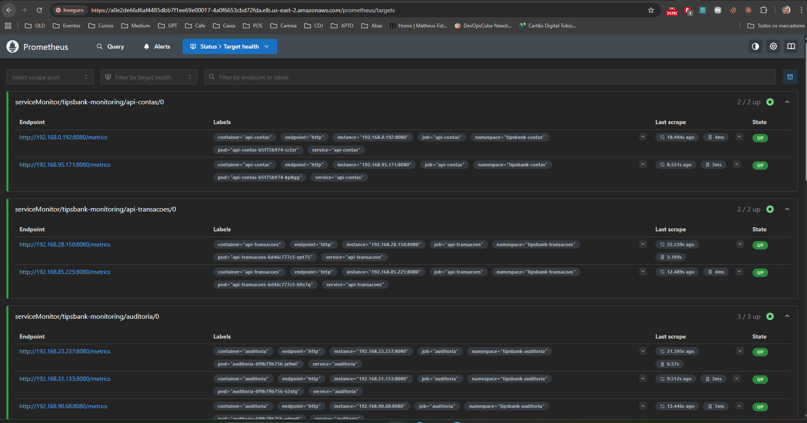

#### Dashboard Grafana


Acesso: `https://a0e2de66d6af4485dbb7f1ee69e00017-4a0f6653cbd72fda.elb.us-east-2.amazonaws.com/grafana`

Dashboard Kubernetes / Compute Resources / Workloads:

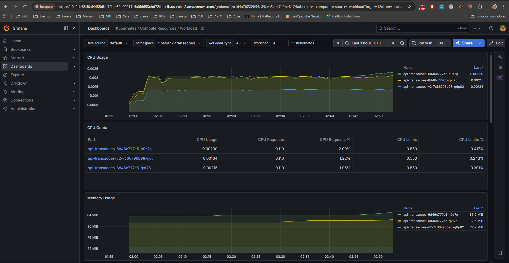

Dashboard Kubernetes / Views / Pods:

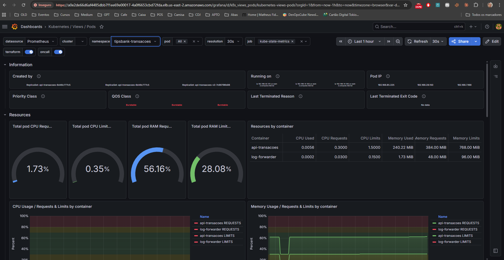


#### Alertmanager


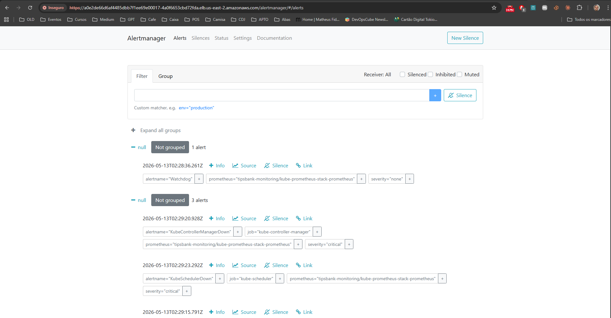

---

### Etapa 3.6 — PrometheusRule com alertas de SLO

**Objetivo**: 4 alertas críticos configurados e disparando em teste.

#### PrometheusRule aplicada


```
romul@HOME MINGW64 /h/Cursos/linuxtips/linuxtips-workspace (main)
$ kubectl get prometheusrule -A | grep tipsbank-slo-alerts
tipsbank-monitoring   tipsbank-slo-alerts                                               86m
```

#### Teste do alerta `TipsBankApiDown`

```
romul@HOME MINGW64 /h/Cursos/linuxtips/linuxtips-workspace (main)
$ kubectl set image deployment/api-transacoes api-transacoes=romulow22/tipsbank-api-transacoes:v1.9.9 -n tipsbank-transacoes
deployment.apps/api-transacoes image updated
```

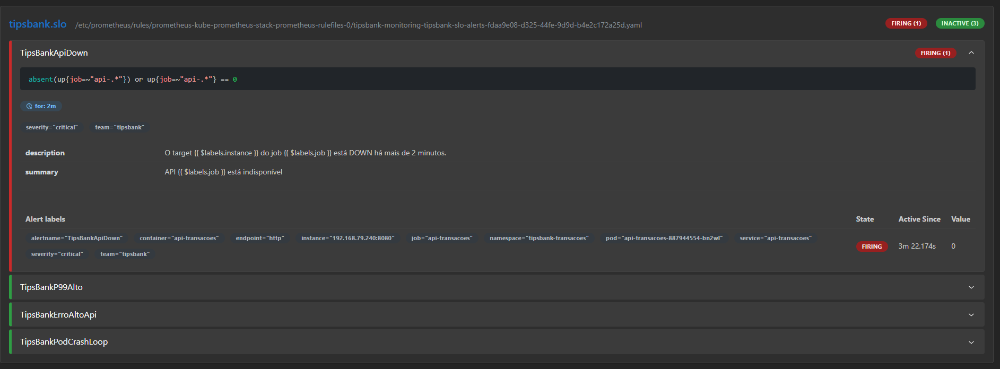

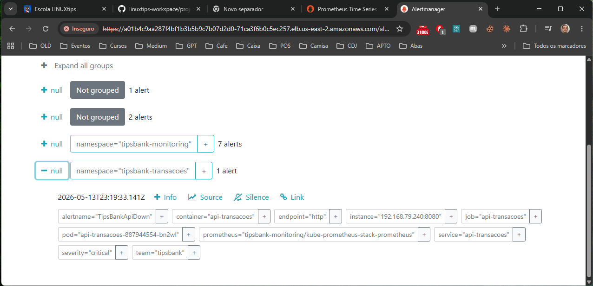

```
romul@HOME MINGW64 /h/Cursos/linuxtips/linuxtips-workspace (main)
$ kubectl rollout undo deployment/api-transacoes -n tipsbank-transacoes
deployment.apps/api-transacoes rolled back
```

#### Teste do alerta `TipsBankErroAltoApi`

```
romul@HOME MINGW64 /h/Cursos/linuxtips/linuxtips-workspace (main)
$ kubectl scale statefulset postgres -n tipsbank-contas --replicas=0
statefulset.apps/postgres scaled
```
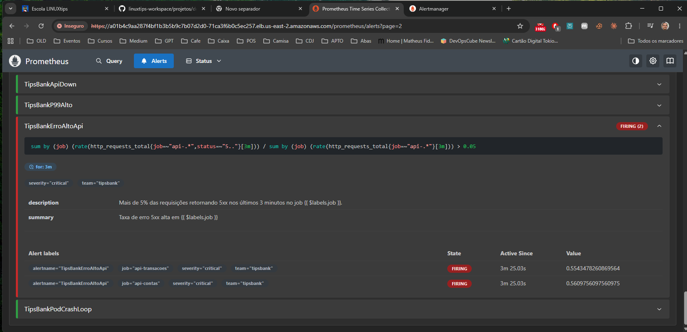

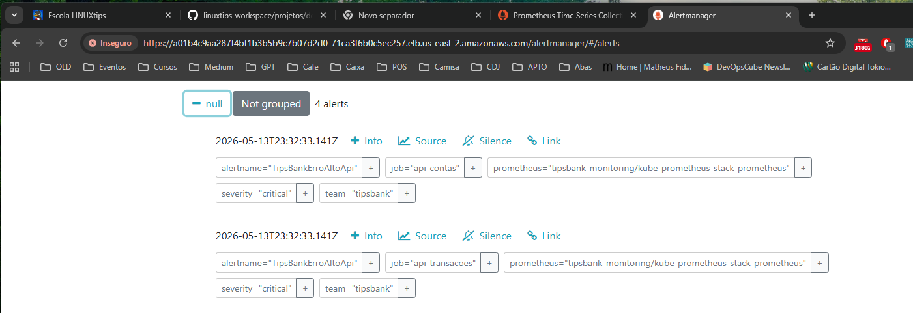

```
romul@HOME MINGW64 /h/Cursos/linuxtips/linuxtips-workspace (main)
$ kubectl scale statefulset postgres -n tipsbank-contas --replicas=1
statefulset.apps/postgres scaled

romul@HOME MINGW64 /h/Cursos/linuxtips/linuxtips-workspace (main)
$ kubectl rollout restart deployment/api-contas -n tipsbank-contas
deployment.apps/api-contas restarted

romul@HOME MINGW64 /h/Cursos/linuxtips/linuxtips-workspace (main)
$ kubectl rollout restart deployment/api-transacoes -n tipsbank-transacoes
deployment.apps/api-transacoes restarted
```

#### Teste do alerta `TipsBankErroPodCrashLoop`

```
romul@HOME MINGW64 /h/Cursos/linuxtips/linuxtips-workspace (main)
$ kubectl patch deployment auditoria -n tipsbank-auditoria --type=json \
  -p='[{"op":"add","path":"/spec/template/spec/containers/0/command","value":["sh","-c","exit 1"]}]'
deployment.apps/auditoria patched
```

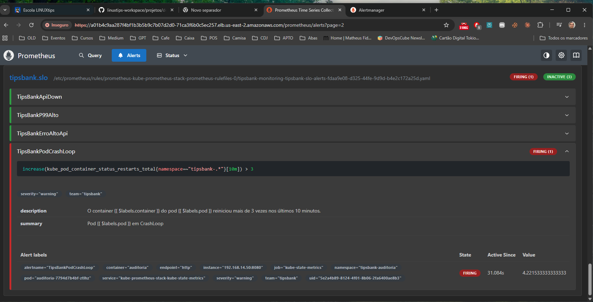

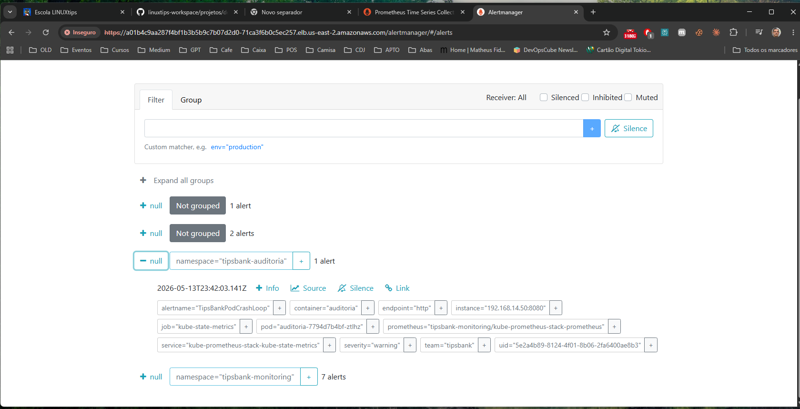

```
PS H:\Cursos\linuxtips\linuxtips-workspace\projetos\desafio-final-dk8s\semana-3> kubectl rollout undo deployment/auditoria -n tipsbank-auditoria
deployment.apps/auditoria rolled back
```


#### Teste do alerta `TipsBankErroP99Alto`


```
romul@HOME MINGW64 /h/Cursos/linuxtips/linuxtips-workspace (main)
$ curl -k -X POST https://a01b4c9aa287f4bf1b3b5b9c7b07d2d0-71ca3f6b0c5ec257.elb.us-east-2.amazonaws.com/locust/swarm   -F "user_count=20000"   -F "spawn_rate=80"
{
  "host": "http://api-transacoes.tipsbank-transacoes.svc.cluster.local:8080",
  "message": "Swarming started",
  "success": true
}
```

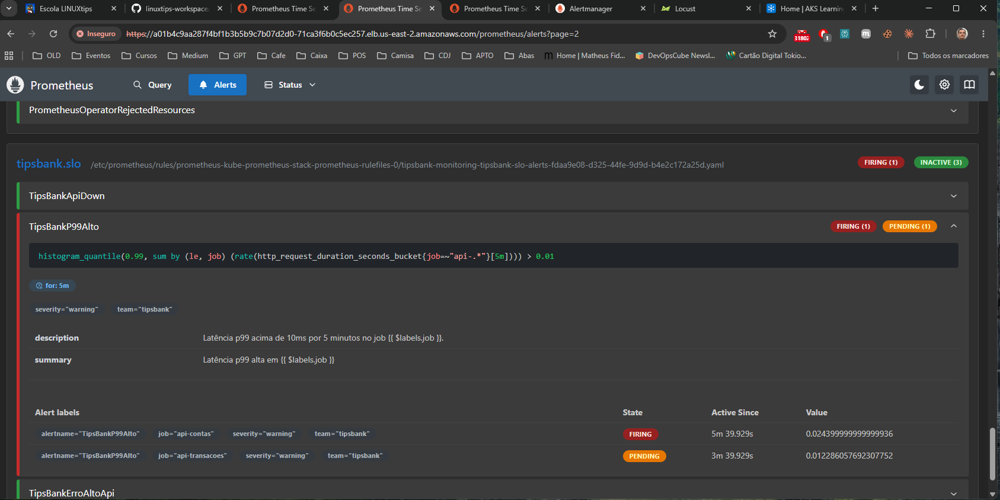

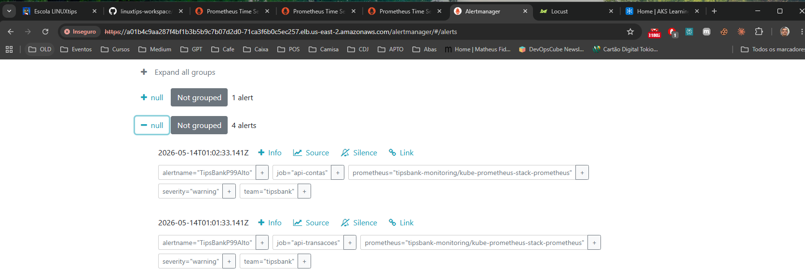


---

### Etapa 3.7 — HPA + Metrics Server + Locust stress test

**Objetivo**: HPA em cada API escalando sob carga real gerada pelo Locust.

#### Metrics Server

```
romul@HOME MINGW64 /h/Cursos/linuxtips/linuxtips-workspace (main)
$ kubectl get pods -n kube-system | grep metrics-server
metrics-server-646b8d7599-8zb5c       1/1     Running   0          3h30m
metrics-server-646b8d7599-hljbz       1/1     Running   0          3h30m

romul@HOME MINGW64 /h/Cursos/linuxtips/linuxtips-workspace (main)
$ kubectl top nodes
NAME                                           CPU(cores)   CPU(%)   MEMORY(bytes)   MEMORY(%)   
ip-192-168-28-133.us-east-2.compute.internal   88m          4%       1564Mi          47%         
ip-192-168-58-57.us-east-2.compute.internal    112m         5%       1919Mi          58%         
ip-192-168-85-60.us-east-2.compute.internal    107m         5%       1097Mi          33%         
```

#### HPAs aplicados

```
romul@HOME MINGW64 /h/Cursos/linuxtips/linuxtips-workspace (main)
$ kubectl get hpa -A
NAMESPACE             NAME                 REFERENCE                   TARGETS           MINPODS   MAXPODS   REPLICAS   AGE
tipsbank-auditoria    hpa-auditoria        Deployment/auditoria        memory: 30%/75%   2         6         2          3h23m
tipsbank-contas       hpa-api-contas       Deployment/api-contas       cpu: 3%/70%       2         10        2          3h24m
tipsbank-transacoes   hpa-api-transacoes   Deployment/api-transacoes   cpu: 2%/70%       3         15        3          3h23m
```

#### Stress test: 50 usuários por 5 minutos

Teste iniciado via UI em `https://a01b4c9aa287f4bf1b3b5b9c7b07d2d0-71ca3f6b0c5ec257.elb.us-east-2.amazonaws.com/locust`:
- Usuários: 50
- Spawn rate: 10/s
- Duração: 5 minutos
- Host: `http://api-transacoes.tipsbank-transacoes.svc.cluster.local:8080`

**HPA escalando durante o teste:**

```
PS H:\Cursos\linuxtips\linuxtips-workspace> kubectl get hpa -n tipsbank-transacoes -w
NAME                 REFERENCE                   TARGETS                                     MINPODS   MAXPODS   REPLICAS   AGE
hpa-api-transacoes   Deployment/api-transacoes   cpu: <unknown>/70%, memory: <unknown>/70%   3         15        2          4h21m
hpa-api-transacoes   Deployment/api-transacoes   cpu: 206%/70%, memory: 100%/70%             3         15        3          4h21m
hpa-api-transacoes   Deployment/api-transacoes   cpu: 193%/70%, memory: 85%/70%              3         15        4          4h21m
hpa-api-transacoes   Deployment/api-transacoes   cpu: 2%/70%, memory: 33%/70%                3         15        5          4h21m
hpa-api-transacoes   Deployment/api-transacoes   cpu: 44%/70%, memory: 39%/70%               3         15        5          4h22m
hpa-api-transacoes   Deployment/api-transacoes   cpu: 127%/70%, memory: 70%/70%              3         15        5          4h22m
hpa-api-transacoes   Deployment/api-transacoes   cpu: 115%/70%, memory: 76%/70%              3         15        5          4h22m
hpa-api-transacoes   Deployment/api-transacoes   cpu: 70%/70%, memory: 81%/70%               3         15        8          4h22m
```

**Resultado do Locust (5 min, 200 usuários):**

```
Type	Name	          # Requests	# Fails	Median (ms)	95%ile (ms)	99%ile (ms)	Average (ms)	Min (ms)	Max (ms)	Average size (bytes)	Current RPS	Current Failures/s
GET	  /extrato/:id	  1032	      0	      11	        290	        4200	      277.38	      3	        36828	    3243.85	              6.4	        0
POST	/transferencias	2990	      0	      110	        1000	      3300	      531.56	      3 	      135438	  177.42	              16.1      	0
      Aggregated	    4022	      0     	95	        910	        3300	      466.34	      3	        135438	  964.23	              22.5	      0

```

**ScaleDown após o teste (dentro de 10 minutos):**

```
PS H:\Cursos\linuxtips\linuxtips-workspace\projetos\desafio-final-dk8s\semana-3> kubectl get hpa -n tipsbank-transacoes -w
NAME                 REFERENCE                   TARGETS                        MINPODS   MAXPODS   REPLICAS   AGE
hpa-api-transacoes   Deployment/api-transacoes   cpu: 2%/70%, memory: 58%/70%   3         15        7          5h07m
hpa-api-transacoes   Deployment/api-transacoes   cpu: 3%/70%, memory: 57%/70%   3         15        5          5h07m
hpa-api-transacoes   Deployment/api-transacoes   cpu: 3%/70%, memory: 50%/70%   3         15        4          5h08m
```

`stabilizationWindowSeconds: 300` no scaleDown garante que o HPA aguarda 5 minutos de CPU baixa antes de remover pods, evitando flapping.

---

### Etapa 3.8 — DaemonSet de coleta

**Objetivo**: um DaemonSet em todos os workers coletando métricas (ou só logando eventos do node) — qualquer propósito didático vale.

#### Verificação: DESIRED == CURRENT == READY

```
romul@HOME MINGW64 /h/Cursos/linuxtips/linuxtips-workspace (main)
$ kubectl get ds -n tipsbank-monitoring
NAME                                             DESIRED   CURRENT   READY   UP-TO-DATE   AVAILABLE   NODE SELECTOR            AGE
kube-prometheus-stack-prometheus-node-exporter   3         3         3       3            3           kubernetes.io/os=linux   23m
node-logger                                      3         3         3       3            3           <none>                   20m
```

#### Log do DaemonSet em execução

```
romul@HOME MINGW64 /h/Cursos/linuxtips/linuxtips-workspace (main)
$ kubectl logs -n tipsbank-monitoring -l app=node-logger --prefix

[pod/node-logger-brrh7/node-logger] {"ts":"2026-05-18T22:46:38Z","node":"ip-192-168-74-99.us-east-2.compute.internal","disk":"7","mem_kb":"2506800"}
[pod/node-logger-brrh7/node-logger] {"ts":"2026-05-18T22:47:08Z","node":"ip-192-168-74-99.us-east-2.compute.internal","disk":"7","mem_kb":"2487700"}
[pod/node-logger-brrh7/node-logger] {"ts":"2026-05-18T22:47:39Z","node":"ip-192-168-74-99.us-east-2.compute.internal","disk":"7","mem_kb":"2499216"}
[pod/node-logger-brrh7/node-logger] {"ts":"2026-05-18T22:48:09Z","node":"ip-192-168-74-99.us-east-2.compute.internal","disk":"7","mem_kb":"2502120"}
[pod/node-logger-dmc9d/node-logger] {"ts":"2026-05-18T22:46:03Z","node":"ip-192-168-26-170.us-east-2.compute.internal","disk":"6","mem_kb":"2771244"}
[pod/node-logger-dmc9d/node-logger] {"ts":"2026-05-18T22:46:34Z","node":"ip-192-168-26-170.us-east-2.compute.internal","disk":"6","mem_kb":"2770816"}
[pod/node-logger-dmc9d/node-logger] {"ts":"2026-05-18T22:47:04Z","node":"ip-192-168-26-170.us-east-2.compute.internal","disk":"6","mem_kb":"2767580"}
[pod/node-logger-dmc9d/node-logger] {"ts":"2026-05-18T22:47:35Z","node":"ip-192-168-26-170.us-east-2.compute.internal","disk":"6","mem_kb":"2765120"}
[pod/node-logger-r4hmz/node-logger] {"ts":"2026-05-18T22:46:04Z","node":"ip-192-168-33-16.us-east-2.compute.internal","disk":"8","mem_kb":"2242472"}
[pod/node-logger-r4hmz/node-logger] {"ts":"2026-05-18T22:46:34Z","node":"ip-192-168-33-16.us-east-2.compute.internal","disk":"8","mem_kb":"2245780"}
[pod/node-logger-r4hmz/node-logger] {"ts":"2026-05-18T22:47:05Z","node":"ip-192-168-33-16.us-east-2.compute.internal","disk":"8","mem_kb":"2210128"}
[pod/node-logger-r4hmz/node-logger] {"ts":"2026-05-18T22:47:35Z","node":"ip-192-168-33-16.us-east-2.compute.internal","disk":"8","mem_kb":"2237900"}

```
